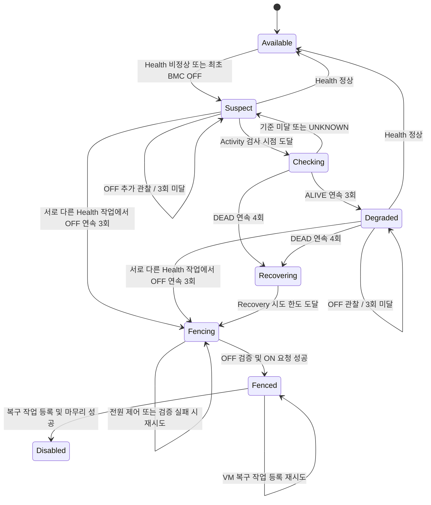

# Europa HA 현재 구현 구조와 설정

> 작성일: 2026-09-11 · 대상: `codex/ha-safety` 현재 작업 트리
>
> `3934c8718a` 커밋 이후의 기본값 변경과 **Health 작업당 BMC 1회 조회·서로 다른 poll의 연속 OFF 3회 누적 및 OFF 증거 만료 시 Activity 복귀** 변경까지 포함한다. 운영 브랜치 `europa-2026`의 배포 상태를 설명하는 문서는 아니다. 아래 값은 **소스 기본값**이며, 운영 DB와 agent에 저장된 실제 적용값은 별도로 확인해야 한다.

> 추가 검증: [권장 설정과 시나리오 검증](europa-ha-recommended-settings-validation.md). **OFF 증거가 만료되면 Health 우선 배정을 해제하여 Activity로 복귀하도록 수정했다.** `ha.checking.interval` 변경은 현재 관리 서버 재시작 후 반영된다.

## 1. 먼저 확인할 핵심

| 항목 | 현재 구현 |
|---|---|
| 정상 상태 `Available` | Health 검사와 BMC 전원 조회를 주기적으로 수행한다. 별도 Activity 반복 검사는 하지 않는다. |
| 빠른 장애 확인 | 서로 다른 Health 작업의 BMC 조회에서 실제 `OFF`가 연속 **3회** 확인되면 HB 만료를 기다리지 않고 `Fencing`에 진입한다. |
| BMC 감지 기본값 | Health 작업당 STATUS **1회**, 조회 timeout **1초**. 유효한 OFF 증거가 누적되는 동안 다음 poll도 Health를 우선 배정한다. poll 기본값은 **10초**다. |
| OFF 증거 유효성 | ON·UNKNOWN·오류로 연속성을 끊는다. 성공한 OFF 관찰 사이가 **60초**를 넘으면 이전 횟수를 버리고 Activity로 복귀한다. 오래된 증거를 합쳐 OFF를 확정하지 않는다. |
| Health / Fence timeout | 각각 **20초 / 60초** |
| 지속 Activity 검사 | Health가 비정상이면 총 횟수 제한 없이 관찰한다. 7회는 검사 종료 횟수가 아니다. |
| `Degraded` 진입 | Activity 연속 `ALIVE` **3회**. 진입 후에도 Health/Activity 검사를 계속한다. |
| Activity 실패 기준 | 기본 7회·50%는 **연속 DEAD 4회**이며, `Recovering`을 거쳐 `Fencing`으로 연결된다. |
| `Available` 복귀 | 대상 호스트의 정상 Health 결과가 필요하다. Activity ALIVE만으로 복귀하지 않는다. |
| 실제 전원 제어 | **Maintenance 확정 → OFF 요청 → OFF 5회 재확인 → ON 요청**. 현재 HA 경로는 `CYCLE`을 직접 호출하지 않는다. |
| VM 복구 | 펜싱 완료 확인 후 다른 호스트에서 비동기로 재시작한다. 장애 호스트의 Maintenance는 유지한다. |

**대화에서 논의했지만 아직 반영하지 않은 내용**도 구분해야 한다.

| 논의 항목 | 현재 상태 |
|---|---|
| 조회 timeout을 2초로 변경 | 미반영. 현재는 1초 / Health 20초다. 과거 반복 감지에서는 Health 30초를 권고했지만, 현재 단일 조회 감지는 조회 2초도 Health 20초 안에 들어가므로 그 권고를 그대로 적용할 필요는 없다. |
| 조기 OFF 확인 결과를 재사용하여 펜싱의 중복 OFF 요청·5회 확인 생략 | 미반영. 현재는 진입 경로와 관계없이 같은 OFF → 확인 → ON 절차를 수행한다. 감지 3회와 펜싱 검증 5회는 별도 설정이다. |
| ALIVE 횟수를 새로운 HB 갱신 횟수로 계산 | 미반영. 같은 최근 HB를 다시 읽어도 ALIVE가 될 수 있다. |

운영 논의의 전제는 **PCS가 장애 호스트를 다시 켜지 않는 것**이다. 이 전제에 따른 중복 확인 생략은 위 표와 같이 아직 코드에 반영하지 않았다. 이 문서는 PCS 설정을 변경하지 않는다.

## 2. 구성요소와 역할

| 구성요소 | 역할 |
|---|---|
| `HAManagerImpl` | 주기적으로 HA 상태와 담당 관리 서버를 확인하고 Health, Activity, Recovery, Fence 작업을 배정한다. |
| `HealthCheckTask` / `KVMHAProvider` | 작업당 최신 BMC STATUS를 한 번 확인하고 호스트별 OFF 연속 횟수를 누적한다. OFF 확인 진행 중에는 일반 agent Health를 생략하고 다음 poll을 기다린다. ON·UNKNOWN이면 기존 Health를 확인한다. |
| `KVMHostActivityChecker` | 대상 호스트의 Health와, 같은 클러스터 이웃 호스트를 통한 스토리지 활동을 조사한다. |
| KVM agent / Activity 스크립트 | 공유 스토리지의 HB와 VM 볼륨 활동을 읽어 ALIVE, DEAD, UNKNOWN을 반환한다. |
| OOBM service / `ipmitool` driver | 호스트에 설정된 드라이버로 BMC의 STATUS, OFF, ON을 실행한다. STATUS는 이전 DB 상태 대신 실시간 조회 결과를 사용한다. |
| `FenceTask` / `HAAbstractHostProvider` | Maintenance를 먼저 확정하고 복구할 VM 목록을 저장한다. 전원 제어 성공 후 VM 복구 작업을 등록한다. |
| 기존 VM HA manager / 배치 처리 | 저장된 복구 작업을 이어서 처리하고, 원래 장애 호스트를 제외한 곳에서 VM을 시작한다. |

`ipmitool`로 설정된 호스트에서는 실제로 `chassis power status`, `chassis power off`, `chassis power on`에 해당하는 동작을 사용한다. Redfish 사용은 필수 조건이 아니다.

BMC 조회는 **관리 서버가 OOBM service를 통해 직접 수행**한다. 대상 KVM agent에 전원 확인을 요청하고 응답을 기다리는 구조가 아니다. agent Health 검사는 별도 단계다.

호스트의 **HA 상태**와 **자원 상태**는 별개다. `Fencing/Fenced/Disabled`는 HA 처리 상태이고, `Maintenance`는 해당 호스트의 VM 시작·배치를 막는 자원 상태다.

## 3. 전체 상태 흐름



이 도식은 활성화·자격 조건을 만족하는 KVM 호스트의 주요 경로다. 숫자는 현재 기본값이며, 관리자가 HA를 비활성화하거나 자격을 잃는 경로는 생략했다. 실제 작업 실행 시점에는 poll과 대기열 지연이 추가된다.

### 3.1 정상 상태와 Health 검사

1. `Available`에서는 Health 작업만 배정한다. 한 Health 작업은 BMC STATUS를 한 번만 조회하며, 감지를 위한 내부 반복이나 3초 대기를 하지 않는다.
2. OFF이면 호스트별 연속 횟수를 1 올린다. 첫 번째 OFF에서 Available은 Suspect로 전환해 관찰 소유권을 확보한다. 기존 Suspect/Degraded는 유지한다. 첫 번째와 두 번째 OFF에서는 일반 agent Health를 기다리지 않고 작업을 끝낸다. 다음 poll에서 증거가 유효하고 Activity 재확인이 필요하지 않으면 Health를 우선 배정한다.
3. 서로 다른 Health 작업에서 OFF가 연속 3회 확인되면 `PowerOffConfirmed` 이벤트로 Fencing에 진입한다. 이 횟수는 BMC의 성공한 OFF 응답만 센다.
4. ON·UNKNOWN·오류이면 OFF 연속성을 초기화하고 기존 Health 검사를 진행한다. 완료된 OFF 관찰 사이의 간격이 `kvm.ha.power.off.max.interval`을 넘으면 현재 OFF부터 1회로 새로 센다. 작업 선택 전에도 유효성을 확인하며, 만료된 경우 Health 우선권을 해제하고 일반 Activity 일정으로 복귀한다.
5. Health가 정상이라면 Available을 유지한다. Suspect/Degraded에서 정상 Health가 확인되면 Available로 복귀하고 Activity 이력을 초기화한다. Health 비정상이면 Suspect로 관찰을 시작하며, 이미 Degraded이면 Degraded를 유지한다.
6. 새 HA 주기, 소유권 변경·상실, provider 변경·상실, HA 비활성화 등의 자격 변경으로 이전 OFF 이력을 재사용하지 않는다. 이 횟수는 메모리 상태이므로 관리 서버 재시작 후에도 0에서 다시 시작한다.

```text
poll 1 → STATUS 1회: OFF → 누적 1 → Available이면 Suspect → 작업 종료
poll 2 → STATUS 1회: OFF → 누적 2 → Suspect 유지 → 작업 종료
poll 3 → STATUS 1회: OFF → 누적 3 → Fencing
```

poll은 작업 배정 주기다. 이미 대기·실행 중인 작업이 있으면 해당 호스트를 건너뛰므로, 모든 poll에서 반드시 조회하거나 정확히 10초 간격으로 조회한다고 보장하지 않는다. 정상 BMC ON 뒤에는 기존 agent Health가 이어질 수 있으므로 **BMC 조회 timeout 1초가 Health 전체의 1초 완료 보장은 아니다.**

**ping·virsh·BMC가 모두 통신 불가라는 사실만으로 완전 다운을 확정하지 않는다.** BMC 응답 실패, 인증 오류, timeout은 OFF가 아니라 확인 불가다.

### 3.2 지속 Activity 검사와 Degraded

Suspect/Degraded에서는 Activity 검사 후 Health 검사도 수행하도록 교대한다. 단, 유효한 OFF가 1회 이상 누적되어 추가 확인이 필요한 동안에는 다음 poll의 Health를 우선하여 새 Activity 작업 때문에 OFF 확인이 밀리지 않도록 한다. 이미 실행 중인 Activity 작업을 강제로 중단하는 것은 아니다. 검사 사이에는 설정 간격과 poll을 적용하며, 한 작업 안에서 무한 반복하지 않는다.

OFF 증거가 만료되면 Activity 재확인을 요청한다. Health 응답 처리 중 만료되어 새 OFF 1회가 기록되더라도 이 요청을 유지하여 다음 poll에서 Health만 다시 우선하지 않도록 한다. 실제 Activity 결과가 현재 작업으로 검증되어 처리될 때 재확인 요청을 해제한다. 작업 예약·제출 실패나 오래된 결과로 요청을 소모하지 않으며, 실행 중인 작업과 기존 Activity 최소 간격은 그대로 존중한다. 만료 자체는 Activity DEAD 누적을 지우지 않는다. UNKNOWN 응답도 재확인 수행으로 처리하지만, 아래와 같이 ALIVE/DEAD 연속성을 끊으므로 DEAD 증거가 되지 않는다.

| Activity 결과 | 연속 카운터 처리 | 상태 처리 |
|---|---|---|
| ALIVE | ALIVE +1, DEAD 초기화 | Checking에서 ALIVE 3회면 Degraded. 이후에도 검사 지속 |
| DEAD | DEAD +1, ALIVE 초기화 | Checking/Degraded에서 실패 임계값에 도달하면 Recovering |
| UNKNOWN / 오류 / timeout | ALIVE와 DEAD 모두 초기화 | Checking이면 Suspect로 관찰 재개, Degraded이면 기존 상태 유지 |

실패 임계값은 다음과 같다.

```text
필요한 연속 DEAD 횟수 = kvm.ha.activity.check.failure.threshold

기본값 4 → 연속 DEAD 4회
설정값 5 → 연속 DEAD 5회
```

검사 총횟수 제한은 없다. 실패 임계값은 양의 정수여야 한다. 0 또는 음수이면 DEAD로 Recovery를 결정하지 않고 연속 카운터를 초기화하며 경고를 남긴다. ALIVE에 따른 Degraded 판단과 별도 BMC OFF 확정 경로는 유지한다.

기존 `kvm.ha.activity.check.max.attempts`와 `kvm.ha.activity.check.failure.ratio`는 폐기했다. 관리 서버 시작 시 기존 글로벌·클러스터 조합을 `floor(max.attempts × failure.ratio) + 1`로 한 번 환산한 뒤 기존 설정을 삭제한다. 따라서 기존 7/0.5는 4, 9/0.5는 5가 된다. 새 설정이 이미 저장되어 있으면 보존하며, 클러스터별 부분 재정의도 기존 상속값을 적용해 환산한다. 잘못된 기존 값은 임의의 기본값으로 바꾸지 않고 0으로 이관하여 관리자가 유효한 임계값을 지정할 때까지 Activity 실패 결정을 보류한다.

예를 들어 Health가 계속 비정상이고 `ALIVE, ALIVE, ALIVE, ALIVE, DEAD, DEAD, DEAD, DEAD`가 이어지면 세 번째 ALIVE에서 Degraded가 되고, 이후 네 번째 연속 DEAD에서 Recovering으로 넘어간다. 중간에 UNKNOWN이나 ALIVE가 끼면 DEAD 연속성은 끊긴다.

Degraded에서 Activity를 다시 검사할 때 DB 상태를 잠시 Checking으로 바꾸지 않는다. 기존 VM HA에는 계속 연결 불가 상태와 활동이 있을 수 있는 호스트로 전달한다. UNKNOWN 뒤에 유지되는 Degraded는 마지막 판단을 보존한 것이며 최신 생존 확정을 뜻하지 않는다.

### 3.3 Recovering에서 Fencing으로

현재 KVM provider의 `recover()`는 별도 전원 복구 명령을 수행하지 않고 실패를 반환한다. Recovery 결과 처리에서 시도 횟수를 올리고, 기본 한도 1회에 도달하면 다음 상태 처리에서 Fencing으로 넘어간다.

따라서 Activity DEAD 경로는 엄밀히 **Checking/Degraded → Recovering → Fencing**이다. 기본 `recover.wait.period=600`은 일반적으로 Recovery 성공으로 `Recovered`에 들어간 경우의 대기 설정이며, 현재 KVM의 이 실패 경로에서 600초를 기다린다는 뜻이 아니다.

## 4. HB 60초와 ALIVE의 의미

Activity ALIVE는 **현재 호스트가 직접 응답했다는 뜻이 아니다.** 다른 호스트가 공유 스토리지에 남은 HB를 읽어서 반환할 수 있다.

| 스토리지 | 현재 HB 판정 |
|---|---|
| RBD, CLVM | 읽은 HB가 미래 시각이 아니고 시간 차이가 전달된 interval 이하면 ALIVE |
| GFS / SharedMountPoint | 시간 차이가 전달된 interval 미만이면 ALIVE. 잘못된 HB·미래 시각은 UNKNOWN |
| NFS | 스크립트에 별도 `시간 차이 < 61초` 조건이 있음 |

RBD/GFS/CLVM에 전달하는 기준은 agent의 `kvm.heartbeat.checker.frequency`에서 오며, 소스 기본값은 60초다. 이 값은 HA poll, Activity 검사 간격, BMC 조회 간격과 각각 별개다.

호스트가 마지막 HB 기록 직후 다운돼도 그 HB가 유효시간 안에 있으면 ALIVE가 나올 수 있다. **같은 HB로 ALIVE 3회가 나와 일시적으로 Degraded에 진입하는 것도 가능하다.** 현재 구현은 새로운 HB 갱신 3회를 요구하지 않는다.

HB가 만료됐다고 무조건 DEAD가 되는 것도 아니다. 후속 볼륨 활동을 확인하며, 읽기 실패나 판단 불가이면 UNKNOWN이다. RBD watcher가 남아 있는데 libvirt 포트가 응답하지 않는 경우도 UNKNOWN이며, CLVM은 이웃의 로컬 프로세스 조회만으로 대상 호스트 정지를 입증하지 않는다.

여러 스토리지를 사용하는 호스트는 적용 대상 풀 중 하나라도 ALIVE면 활동이 있는 것으로 처리한다. 모두 명시적으로 DEAD여야 실패 표본이 되고, ALIVE 없이 UNKNOWN이 남으면 판단을 보류한다.

## 5. 현재 펜싱과 VM 복구 순서

**조기 BMC OFF 경로와 Activity DEAD 경로 모두 아래 공통 절차를 사용한다.** 감지 단계에서 OFF를 3회 확인한 경우에도 현재는 OFF 요청과 반복 확인을 다시 수행한다. 감지는 poll마다 1회이지만, 아래 펜싱 검증은 하나의 Fence 작업 안에서 5회 반복한다.

1. **Fencing 상태와 작업 소유권을 확인한다.** 오래된 작업 결과가 새 HA 처리에 영향을 주지 않도록 검사한다.
2. **호스트를 Maintenance로 먼저 전환한다.** DB 저장 후 재조회로 확인하고, 연결된 agent에도 유지보수 처리를 적용한다.
3. **복구 대상 VM ID·UUID를 DB에 보존한다.** 재부팅 보고로 VM의 `host_id`가 바뀌어도 대상을 잃지 않도록 `host_details`에 목록을 저장한다.
4. **BMC에 OFF를 요청한다.** 명령 직전에 Maintenance, HA 활성화, 담당 관리 서버, 클러스터·존 자격을 다시 확인한다.
5. **실시간 OFF를 연속 5회 확인한다.** 조회 완료 후 3초씩 기다린다. ON/UNKNOWN/오류가 나오면 연속성을 초기화하고 남은 제한시간 안에서 재시도한다.
6. **OFF 확인에 성공한 뒤 ON을 요청한다.** 여기서도 전원 변경 전 조건을 다시 검사한다. 현재는 OFF와 ON을 나눠 호출하며 CYCLE을 사용하지 않는다.
7. **ON 요청 성공 후 Fenced 상태를 DB에 기록한다.** ON 요청 성공은 OS 부팅 완료나 agent 재접속 완료를 확인했다는 뜻은 아니다.
8. **저장한 목록으로 VM 복구 작업을 DB에 등록한다.** Maintenance를 다시 확인하고 호스트 연결을 Down으로 처리한 뒤, `HostFenced` 사유와 원래 호스트 정보를 보존한 작업을 생성한다.
9. **작업 등록이 완료되면 목록을 정리하고 해당 호스트 HA를 비활성화한다.** 호스트의 Maintenance는 유지한다.
10. **VM HA worker가 다른 호스트에서 VM을 비동기로 재시작한다.** 8번에서 작업이 등록되면 실행 가능하므로 9번의 마무리와 병행될 수 있다. 원래 장애 호스트를 배치 대상에서 제외하며, 이는 실행 중인 VM의 live migration이 아니다.

`Fencing`은 진행 중, `Fenced`는 전원 절차 성공 후의 DB 체크포인트다. 이후 HA가 Disabled로 바뀌는 것은 복구 작업 등록과 마무리가 끝났다는 뜻이며, 모든 VM의 기동 완료를 보장하는 상태는 아니다.

조기 OFF 확인은 Activity 결과를 DEAD로 바꾸지 않는다. 별도 이벤트로 펜싱에 진입하며, Fencing/Fenced 이후 늦게 도착한 Activity 결과는 반영하지 않는다.

### 실패와 재시작 시 처리

| 발생 상황 | 현재 처리 |
|---|---|
| Maintenance 저장·재확인 또는 VM 목록 저장 실패 | 전원 조작으로 넘어가지 않음 |
| OFF 요청 실패 또는 OFF 확인 불가 | ON 및 해당 경로의 VM 복구로 넘어가지 않음. Maintenance 유지 |
| ON 요청 실패 | Fenced 완료 처리하지 않고 격리 상태에서 재시도 |
| Fenced 이후 VM 복구 작업 등록 실패 | 저장된 목록으로 등록을 재시도. 이 단계에서는 전원 시퀀스를 다시 실행하지 않음 |
| ON 요청 성공 직후, Fenced DB 기록 전에 관리 서버 종료 | 다음 시도에서 OFF/ON이 반복될 수 있음. BMC 명령과 DB 기록은 하나의 원자적 작업이 아님 |
| 관리 서버 재시작 중 Checking/Degraded | 진행 중이던 메모리 작업·연속 카운터를 그대로 신뢰하지 않고 관찰과 소유권 확보를 재개 |

## 6. 글로벌 설정과 적용 범위

### 6.1 설정값 우선순위

클러스터 범위의 KVM HA 키는 **클러스터에 저장된 값 → 전역에 저장된 값 → 소스 기본값** 순으로 해석한다. Java 기본값을 바꾸어도 기존 DB의 설정값을 자동으로 덮어쓰지 않는다.

기존 DB에 감지 횟수 5회나 poll 5초가 저장돼 있으면 아래 소스 기본값 3회·10초로 자동 변경되지 않는다. 감지 횟수와 펜싱 검증 횟수를 별도로 확인한다. agent의 `agent.properties` 설정은 관리 서버 글로벌 설정과 별개다.

`kvm.ha.power.off.max.interval`은 실제 OFF 조회 간격보다 충분히 길게 잡아야 한다. 예를 들어 기존 poll 60초가 저장돼 있는데 최대 허용 간격도 60초이면 조회·스케줄링 지연 때문에 매번 연속성이 초기화될 수 있다. 수정 후에는 만료된 증거의 Health 우선권을 해제하여 Activity 관찰을 재개하지만, 이 조합으로 빠른 OFF 3회 확정을 보장하지는 않는다. 최대 간격을 코드에서 자동으로 늘리지 않는다. poll과 대기열 지연을 함께 고려하며, 소스 기본 조합은 poll 10초 / 최대 간격 60초다.

OFF 누적 호스트를 처리할 때 최대 간격이 실제 등록된 poll 이하이면 경고한다. 경고는 provider·등록 poll·최대 간격 조합별로 관리 서버 실행 중 한 번 기록하며, UI에서 바뀐 값 대신 현재 스케줄에 등록된 간격을 사용한다. `ha.checking.interval`의 실행 중 재등록은 구현하지 않았으므로 변경 후 관리 서버 재시작이 필요하다.

### 6.2 전역 poll 및 작업 처리량

| 글로벌 설정 키 | 소스 기본값 | 의미 |
|---|---:|---|
| `ha.checking.interval` | 10초 | HA 상태를 순회하고 다음 작업을 배정하는 poll 간격 |
| `ha.max.concurrent.health.check.operations` | 10 | 관리 서버당 Health 작업 병렬 수 |
| `ha.max.pending.health.check.operations` | 100 | Health 대기열 크기 |
| `ha.max.concurrent.activity.check.operations` | 10 | 관리 서버당 Activity 작업 병렬 수 |
| `ha.max.pending.activity.check.operations` | 100 | Activity 대기열 크기 |
| `ha.max.concurrent.recovery.operations` | 10 | 관리 서버당 Recovery 작업 병렬 수 |
| `ha.max.pending.recovery.operations` | 100 | Recovery 대기열 크기 |
| `ha.max.concurrent.fence.operations` | 10 | 관리 서버당 Fence 작업 병렬 수 |
| `ha.max.pending.fence.operations` | 100 | Fence 대기열 크기 |

호스트 하나에는 작업 하나만 진행하도록 예약을 관리한다. 대기열이 꽉 찼을 때 실행 중이던 다른 작업을 조용히 버리지 않고 제출을 거부하여 이후 재시도하도록 한다. 작업이 timeout돼도 실제 실행과 결과 처리가 끝나기 전에는 같은 호스트에 작업을 중복 제출하지 않도록 보호한다. 이번 변경으로 Health의 OFF 감지 중 3초 대기 반복은 제거했지만, 여러 호스트의 조회·일반 Health 실행에 따른 대기열 지연까지 없어지는 것은 아니다.

병렬 수·대기열 크기는 현재 코드에서 관리 서버 구성 시 스레드 풀을 만들 때 읽는다. 설정이 dynamic으로 선언돼 있어도 기존 풀 크기가 즉시 바뀌는 구현은 아니므로 재구성·재시작 시점을 고려한다.

### 6.3 KVM HA 설정 — 전역 기본값, 클러스터별 재정의 가능

| 설정 키 | 소스 기본값 | 현재 의미 |
|---|---:|---|
| `kvm.ha.power.off.check.enabled` | true | Health 작업에서 조기 BMC OFF 확인 사용. 끄더라도 펜싱 단계의 OFF 검증을 생략하지 않음 |
| `kvm.ha.power.off.confirmations` | 3회 | 서로 다른 Health 작업에서 조기 장애를 확정할 연속 OFF 횟수. 허용 최소 3회 |
| `kvm.ha.power.off.max.interval` | 60초 | 성공한 OFF 관찰 사이의 최대 허용 간격. 초과 시 현재 OFF를 1회로 다시 계산. 허용 범위 1~3600초이며 대기시간이나 HB 설정이 아님 |
| `kvm.ha.fence.power.off.confirmations` | 5회 | OFF 요청 후 실제 OFF를 검증할 연속 횟수. 감지 횟수와 분리. 허용 최소 3회 |
| `kvm.ha.power.check.interval` | 3초 | **펜싱 검증에서만** 이전 STATUS 완료 후 다음 조회까지 대기. 조기 감지에는 적용하지 않음. 허용 최소 1초 |
| `kvm.ha.power.check.timeout` | 1초 | STATUS 조회 한 번의 제한시간. 허용 최소 1초 |
| `kvm.ha.health.check.timeout` | 20초 | Health 작업 제한시간. STATUS 한 번과 필요한 일반 Health 처리에 적용하며, 큐 대기시간은 포함하지 않음 |
| `kvm.ha.activity.check.timeout` | 60초 | Activity 작업 제한시간. HB의 60초 유효시간과 다른 설정 |
| `kvm.ha.activity.check.interval` | 5초 | Activity 검사 간 최소 간격. Health 교대·poll·실행시간에 따라 실제 간격은 더 길어짐 |
| `kvm.ha.activity.check.failure.threshold` | 4 | Recovery에 필요한 연속 DEAD 횟수. 양의 정수, 검사 총횟수 제한 없음 |
| `kvm.ha.activity.check.success.threshold` | 3회 | Health 비정상 중 Degraded 진입에 필요한 연속 ALIVE 횟수 |
| `kvm.ha.degraded.max.period` | 60초 | 호환성 유지용 기존 키. 현재 지속 관찰에서 별도 60초 대기를 만들지 않음 |
| `kvm.ha.recover.timeout` | 60초 | Recovery 작업 제한시간 |
| `kvm.ha.recover.failure.threshold` | 1회 | Recovery 시도 한도. 현재 KVM에서는 실패 후 Fencing으로 연결 |
| `kvm.ha.recover.wait.period` | 600초 | Recovered 상태의 대기시간. 현재 KVM의 Recovery 실패 경로에는 적용되지 않음 |
| `kvm.ha.fence.timeout` | 60초 | OFF 요청·반복 확인·ON 요청을 포함한 전원 펜싱 제한시간 |

### 6.4 스토리지와 agent 관련 설정

| 키 / 위치 | 소스 기본값 | 의미와 적용 시 주의 |
|---|---:|---|
| `kvm.ha.on.storage.heartbeat` | false | 스토리지 풀 범위의 HB 사용 설정. 현재 KVM HA 자격 판단과 Activity 풀 선택에 사용 |
| `kvm.ha.fence.on.storage.heartbeat.failure` | false | 기존 스토리지 Health 조사 정책. Zone 범위로 선언돼 있지만 현재 KVM 호출부는 전역 `value()`를 읽으므로 Zone 재정의가 적용된다고 가정하지 않음 |
| agent: `kvm.heartbeat.update.frequency` | 10000ms | HB 타임스탬프 갱신 주기, 즉 10초 |
| agent: `kvm.heartbeat.checker.frequency` | 60000ms | RBD/GFS/CLVM 검사에 전달하는 HB 시간 차이 기준, 즉 60초 |
| agent: `kvm.heartbeat.checker.timeout` | 360000ms | agent 측 HB checker 실행 제한. 관리 서버의 Activity timeout과 구분 |
| `outofbandmanagement.action.timeout` | 60초 | 일반 OOBM 동작의 기본 제한. 현재 HA STATUS는 `kvm.ha.power.check.timeout`을 명시해 호출하므로 이 60초를 사용하지 않음 |

agent 표는 `AgentProperties.java`의 실제 선언값을 기준으로 한다. 저장소의 `agent.properties` 주석 예시에는 HB 갱신 주기 60000ms가 남아 있으므로 주석과 실효 기본값을 혼동하지 않는다. 실제 agent에 명시한 값이 있으면 그 값을 확인한다.

## 7. 전원 확인 시간 계산

### 7.1 조기 감지 — 여러 Health 작업에 걸친 누적

감지 작업은 STATUS를 한 번 호출하고 끝낸다. OFF 응답이면 agent Health를 생략하므로, 조회 사이에 3초씩 기다리면서 Health worker를 점유하던 대기는 없다.

```text
감지 횟수 = 3회
poll 기본값 = 10초
조회 한 번의 timeout = 1초

지연 없이 각 poll에 배정되는 예:
t≈0초: OFF 1회 → 작업 반환
t≈10초: OFF 2회 → 작업 반환
t≈20초: OFF 3회 → Fencing 전이
```

위 시간은 첫 검사 시작을 기준으로 한 예다. 실제로는 poll 위상, BMC 응답, 대기열, 이미 실행 중인 작업이 영향을 주므로 정확히 20초에 확정한다고 보장하지 않는다. 성공한 OFF 응답 간격이 기본 60초를 넘으면 오래된 증거를 합치지 않고 현재 OFF부터 새로 누적한다. **60초를 먼저 기다리는 로직은 아니다.**

감지 설정 검증에는 STATUS **한 번의 timeout**과 Health timeout의 여유를 비교한다. 과거의 `5 × 1 + 4 × 3 = 17초` 반복 확인 예산은 더 이상 Health에 적용하지 않는다. 따라서 기존 Health timeout 10초와 STATUS timeout 1초의 조합도 반복 확인 예산 부족을 이유로 거부되지 않는다. 소스 기본 Health timeout은 20초를 유지한다.

### 7.2 펜싱 검증 — 한 Fence 작업 안의 반복 확인

```text
N = kvm.ha.fence.power.off.confirmations
I = 조회 완료 후 대기시간(초)
T = 조회당 timeout(초)
B = N × T + (N - 1) × I

현재 펜싱 검증: N=5, I=3, T=1 → B=17초
```

5회 조회 사이에는 대기가 4번 있으므로 대기 합계는 12초다. 실제 확인 소요시간은 여기에 조회 5회의 실제 응답시간이 더해진다. 정상 응답이 빨라도 12초의 대기는 남는다.

Fence는 `Fence timeout > B + 21`을 요구한다. 현재는 `60 > 17 + 21`로 충족한다. 추가 여유는 OFF·ON 요청 및 작업 종료를 위한 것이다. Health timeout은 이 반복 확인 예산에 사용하지 않는다. 예산을 충족하지 않으면 검증을 건너뛰어 성공 처리하지 않는다.

**이 수치는 호스트 장애 발생부터 VM 복구 완료까지의 시간 보장이 아니다.** poll 대기, 작업 대기열, 이미 실행 중인 검사, 펜싱 시 OFF 재확인과 ON 요청, VM 배치·기동 시간이 별도로 든다. 조기 감지의 worker 대기를 제거한 변경이며, 펜싱 단계의 반복 OFF 확인은 유지한다.

조회 제한 1초를 넘는 BMC 응답은 UNKNOWN이 될 수 있어 조기 감지가 늦어지거나 펜싱 검증이 끝나지 않을 수 있다. 2초는 응답을 기다릴 여유를 늘리지만, 실제 장비 응답시간은 현장 검증 대상이다.

## 8. 운영에서 확인할 조건과 대표 상황

일반 HA 관찰 대상은 호스트·클러스터·존의 HA가 활성화돼 있고, OOBM이 설정·활성화된 KVM/LXC 호스트다. 기존 Maintenance/비활성 호스트는 일반 대상에서 제외한다. 같은 클러스터에 Up 상태의 이웃 호스트와 HB가 활성화된 사용 스토리지가 필요하며, 실제 Activity 조사자는 해당 풀에도 연결돼 있어야 한다. 진행 중인 펜싱은 Maintenance를 유지한 채 마무리할 수 있도록 별도로 처리한다.

| 상황 | 기대할 수 있는 동작 |
|---|---|
| 호스트 정상, BMC ON | Available에서 Health/BMC 확인. Activity 반복 검사 없음 |
| 실제 전원 OFF, BMC 통신 가능 | 서로 다른 Health 작업에서 OFF 연속 3회 확정 후 HB 만료를 기다리지 않고 Fencing 경로로 진행 |
| OFF 1~2회 뒤 ON·UNKNOWN·오류 | OFF 횟수 초기화 후 일반 Health로 관찰 |
| OFF 응답 사이가 최대 허용 간격 60초 초과 | 이전 OFF 증거의 우선권을 해제하고 Activity 재확인. Activity DEAD가 누적되면 Recovering/Fencing 경로로 진행 |
| ping·virsh·BMC 모두 불통 | 통신 불가만으로 완전 다운 확정 안 함. 최근 HB는 ALIVE일 수 있으며 후속 관찰 지속 |
| Health 비정상, Activity ALIVE 3회 | Degraded 진입 후 지속 관찰. Available 복귀는 정상 Health가 필요 |
| Activity가 ALIVE/DEAD/UNKNOWN 사이에서 변동 | 연속 기준을 채우지 못하면 검사를 계속함. UNKNOWN은 실패로 누적하지 않음 |
| Activity DEAD가 기준에 도달했지만 BMC는 계속 불통 | Fencing을 시도할 수 있으나 전원 펜싱을 완료했다고 확정하거나 해당 경로의 VM 복구를 시작하지 않음 |
| 재부팅한 장애 호스트가 빠르게 다시 연결됨 | Maintenance 및 VM Start 차단 유지. HA 복구 배치에서 원래 호스트 제외 |

배포 시 관리 서버, KVM agent, 관련 HA 스크립트를 함께 맞춘다. 구형 agent의 일반 Answer는 새 명시적 판정과 구분되어 UNKNOWN이 될 수 있다. 실제 저장된 설정, BMC 응답시간, 스토리지 HB 갱신, 부팅 후 Maintenance 유지와 원래 호스트 제외를 함께 확인한다.

이번 설정 통합 빌드를 적용할 때는 모든 관리 서버를 중지하고 동일 빌드로 맞춘 뒤 시작한다. 시작 시 기존 두 설정이 새 실패 임계값으로 이관·삭제되므로 이전 빌드와 혼용하지 않는다. 이관 뒤 글로벌·클러스터의 `kvm.ha.activity.check.failure.threshold` 값을 확인한다.

VM 복구 대상에는 기존 HA 정책이 적용된다. HA 비활성 VM, 로컬 root volume, 이미 다른 호스트로 이동했거나 제거된 VM 등은 동일하게 복구되지 않을 수 있다. Mold의 Start 차단은 PCS/libvirt 등 외부 실행 주체의 정책을 직접 변경하는 기능은 아니다.

## 9. 소스 위치와 검증 기록

| 확인할 내용 | 소스 |
|---|---|
| KVM HA 기본값 | [KVMHAConfig.java](../../plugins/hypervisors/kvm/src/main/java/org/apache/cloudstack/kvm/ha/KVMHAConfig.java) |
| 기존 실패 설정의 자동 이관 | [KvmHaActivityThresholdMigration.java](../../engine/schema/src/main/java/com/cloud/upgrade/KvmHaActivityThresholdMigration.java) |
| 전역 poll / 동시 작업 설정 | [HAManager.java](../../server/src/main/java/org/apache/cloudstack/ha/HAManager.java) |
| 상태 전이 정의 | [HAConfig.java](../../api/src/main/java/org/apache/cloudstack/ha/HAConfig.java) |
| 작업 배정과 소유권·중복 보호 | [HAManagerImpl.java](../../server/src/main/java/org/apache/cloudstack/ha/HAManagerImpl.java) |
| Health / Activity / Fence 실행 | [HA task 디렉터리](../../server/src/main/java/org/apache/cloudstack/ha/task) |
| BMC OFF 확인 및 OFF→ON 제어 | [KVMHAProvider.java](../../plugins/hypervisors/kvm/src/main/java/org/apache/cloudstack/kvm/ha/KVMHAProvider.java) |
| 이웃 호스트와 스토리지 조사 | [KVMHostActivityChecker.java](../../plugins/hypervisors/kvm/src/main/java/org/apache/cloudstack/kvm/ha/KVMHostActivityChecker.java) |
| Maintenance와 VM 목록 보존 | [HAAbstractHostProvider.java](../../server/src/main/java/org/apache/cloudstack/ha/provider/host/HAAbstractHostProvider.java) |
| VM 복구 작업·배치 연결 | [HighAvailabilityManagerImpl.java](../../server/src/main/java/com/cloud/ha/HighAvailabilityManagerImpl.java) |
| agent HB 기본값 | [AgentProperties.java](../../agent/src/main/java/com/cloud/agent/properties/AgentProperties.java) |
| HB / Activity 판정 스크립트 | [KVM 스크립트 디렉터리](../../scripts/vm/hypervisor/kvm) |

**최신 단일 실패 임계값 변경은 Checkstyle을 활성화한 44개 모듈 빌드와 289개 회귀 테스트를 통과했다.** 실패·오류·제외 0개이며, 설정 이관·글로벌/클러스터 값 보존, 직접 지정한 DEAD 임계값, 지속 관찰 및 기존 HA 보호를 검증했다. 상세 결과는 [HA 검증 기록](europa-ha-safety-validation.md)에 있다.

이전 OFF 증거 만료 보완은 Checkstyle을 활성화한 44개 모듈 빌드와 251개 회귀 테스트를 통과했다. 만료·지연 응답·Activity 복귀 및 기존 보호를 다루는 새 회귀 테스트 10개를 포함한다.

이전 **Health 작업당 BMC 1회·poll 간 OFF 3회 누적** 변경은 **43개 모듈 빌드 성공, Java 회귀 테스트 236개 통과**를 확인했다. 실패·오류·제외는 0개다. STATUS 단일 조회, 작업 간 OFF 누적과 초기화, Health 우선 배정, 감지·펜싱 검증 설정 분리 및 기존 HA 복구 회귀를 검증했다. IPMI driver와 simulator도 빌드했다. 상세 결과와 재현 명령은 [HA 검증 기록](europa-ha-safety-validation.md)에 있다.

아래 수치는 이전 구현 단계의 별도 실행이며 현재 실행 수에 합산하지 않는다.

이전 기본값 조정에서는 **38개 모듈 빌드 성공, 선택한 Java 회귀 테스트 91개 통과**를 확인했다. 당시 전원 안전성 테스트 24개는 한 Health 작업 안의 5회·3초·1초 확인과 그 예산을 다뤘다. 이후 감지 구조가 바뀌었으므로 Health 10초와의 비호환 등 당시 결과를 현재 감지 조건에 적용하면 안 된다.

그보다 앞선 지속 Activity/Degraded 변경은 42개 모듈 빌드와 Java 195개 회귀 테스트를 통과했다. 각 실행은 선택한 테스트 묶음이므로 개수를 합쳐 전체 테스트 수로 해석하지 않는다. 실제 BMC·PCS·스토리지 장애 시험이나 운영 배포를 완료했다는 의미는 아니다.

- 상세 결과·재현 명령: [HA 검증 기록](europa-ha-safety-validation.md)
- 최초 변경 배경·계획: [HA 구현계획서](europa-ha-safety-implementation-plan.md)

현재 동작과 설정을 확인할 때는 이 문서를 우선 보고, 과거 계획과 검증 기록은 변경 배경 및 검증 근거로 사용한다.
