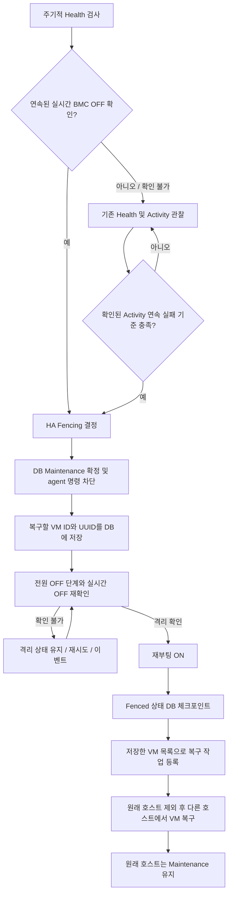

# Europa HA 감지 및 재부팅 복구 구현계획서

- 기준: `europa-2026`, 검토 시작 HEAD `1fcb1b0467`
- 전원 정책: 사용자 선택에 따라 **재부팅 유지**. 부팅 후에도 Maintenance를 유지하고 VM은 다른 호스트에서 복구한다.
- 범위: Mold 코드 구현, 자동화된 회귀 검증, 현장 인수시험 절차. 현장 PCS 설정 변경과 실제 호스트 전원 조작은 이 로컬 구현에 포함하지 않는다.

## 1. 확인한 현재 흐름

`Health 실패 → Suspect → Activity 검사 → 연속 실패 임계값 → Recovering → Fencing → 전원 CYCLE → VM 복구 예약 → Maintenance`

1. RBD/GFS/CLVM은 마지막 HB가 기본 60초 이내면 ALIVE로 반환한다. NFS Activity에는 별도 61초 상수가 있다.
2. 7회·50%는 연속 실패 4회 기준이다. 초기 성공 4회가 나오면 남은 3회로 기준을 채울 수 없다는 이유로 Degraded에 들어가 기본 60초를 더 기다린다. 9회·50%는 연속 실패 5회다.
3. HA 전체 poll 간격과 Activity 간격은 별개이며, 실제 검사 주기는 poll에 영향을 받는다.
4. BMC STATUS 응답이 최신 driver 결과 대신 이전 DB 전원 상태를 담을 수 있다. Redfish의 PoweringOff도 Off로 해석한다.
5. 현재 fencing은 Unknown을 성공으로 반환하고 Off이면 ON, 그 외에는 CYCLE을 실행한다. 명령 성공이 실제 격리 증거로 사용된다.
6. VM 재시작 예약이 Maintenance보다 앞서며, 원래 호스트를 명시적으로 배치에서 제외하지 않는다.
7. 작업 timeout, 지연된 결과, 중복 Recovery/Fence 제출 및 관리 서버 재시작 사이의 처리를 함께 보완해야 한다.

## 2. 변경 후 안전 조건

- 조회 실패, timeout, 인증 오류, 응답 파싱 실패는 UNKNOWN이다. ALIVE나 확인된 DEAD 표본으로 변환하지 않는다.
- Ping 또는 libvirt 연결 실패 횟수만으로 완전 다운을 확정하지 않는다.
- 조기 확정은 서로 분리된 **여러 번의 실시간 BMC OFF 확인**에 한정한다. On, Unknown, 오류가 끼면 OFF 확인은 성립하지 않는다.
- 기존 Activity 실패 임계값 7/50%=4회, 9/50%=5회를 유지한다. 초기 성공 때문에 관찰을 중단하지 않는다.
- VM 복구보다 먼저 DB Maintenance를 확정하고, 연결된 agent에도 명령 차단을 적용한다.
- 전원 명령의 성공 응답만으로 격리됐다고 판단하지 않는다. OFF 단계와 실제 OFF 확인을 거친 뒤 재부팅 ON을 수행한다.
- 부팅·재접속으로 Maintenance를 자동 해제하지 않는다. HA 복구 배치에서는 원래 장애 호스트를 명시적으로 제외한다.
- 상태 전이 실패 또는 오래된 작업 결과가 VM 복구, 전원 동작, HA 비활성화로 이어지지 않도록 한다.

## 3. 구현할 흐름

재부팅 성공과 VM 복구 작업 등록은 재진입을 고려한다. ON 실패나 관리 서버 재시작이 발생했을 때 이미 확인한 격리·복구 단계를 어떻게 재개할지 코드와 테스트에서 명시한다.

구현 중 추가 확인: agent의 재부팅 상태 보고가 VM의 `host_id`를 지울 수 있으므로, 전원 조작 전에 `host_details`에 VM별 ID·UUID를 보존한다. 복구 작업은 `HostFenced` 사유와 원래 호스트 ID를 가진 DB 작업으로 먼저 등록한 뒤 VM stop 상태 정리를 수행한다. Fenced 이후 재시도는 전원 조작을 반복하지 않고 복구 작업 등록을 재개한다.

## 4. 구현 묶음과 대상

| 묶음 | 변경 내용 | 주요 대상 |
|---|---|---|
| A. 전원 증거 | STATUS 단일 조회, fresh 결과 반환, 전환 중 상태 구분, timeout·null 처리 | OOBM service, IPMI/Redfish driver 및 client |
| B. 빠른 확인 | 제한 시간 안의 반복 OFF 확인을 별도 HA 이벤트로 전달. 단일 조회 실패로 확정하지 않음 | KVMHAProvider, KVMHAConfig, HAConfig, HealthCheckTask |
| C. 지속 관찰 | 초기 성공에 따른 Degraded 대기 제거, 연속 실패 보존, UNKNOWN 제외, 이벤트 문구 정리 | ActivityCheckTask, HAResourceCounter, KVM HA 설정 설명 |
| D. 작업 순서 | 같은 호스트 작업 중복 억제, 현재 상태·소유권·작업 세대 확인, timeout 이후 늦은 결과 차단 | BaseHATask, HAManagerImpl, Health/Recovery/FenceTask |
| E. 격리와 복구 | Maintenance 선행 및 성공 검증, fencing 중 자격 예외, OFF 확인 후 ON, 원래 호스트 배치 제외 | HAAbstractHostProvider, KVMHAProvider, VM HA manager, deployment planner |
| F. Activity 정확성 | 명시적 ALIVE/DEAD/UNKNOWN 전달, 초/밀리초 오류 수정, 오류를 정상으로 반환하지 않음 | Activity command/answer/wrapper, LibvirtStoragePool, 관련 scripts |

기존 사용자가 수정한 `KVMHostActivityChecker`의 null guard와 별도 작업 파일은 보존한다.

## 5. 설정 및 호환성

- `max.attempts`와 `failure.ratio` 키 및 임계값 수식은 유지한다. 고정된 배치 검사 후 대기하는 의미는 지속적인 연속 실패 관찰로 바뀌며 설정 설명도 변경한다.
- `kvm.ha.degraded.max.period` 키는 호환성을 위해 남기지만, 지속 관찰에서는 이 대기 시간을 적용하지 않는다. Health와 Activity를 교대로 수행하므로 실제 Activity 간격은 설정값보다 길어질 수 있다.
- HB 60초를 일괄적으로 낮추지 않는다. 기존 storage 보호 여유는 유지하고, 확실한 OFF에 별도 조기 경로를 추가한다.
- 조기 OFF 확인에는 최소 확인 횟수, 확인 간격, 개별 조회 timeout을 사용한다. 전체 Health/Fence 작업 timeout 안에서 종료되도록 검증한다.
- 전체 HA poll 기본값을 60초에서 5초로 변경한다. 현장에 저장된 `ha.checking.interval` override는 자동으로 덮어쓰지 않는다. 기존 설치에서는 실제 저장값을 확인하고, 5초 적용 시 BMC·agent 부하를 함께 측정한다.
- BMC에도 전원이 없거나 관리망이 끊긴 경우에는 60초 미만 확정을 보장하지 않는다. 이 경우 UNKNOWN과 기존 관찰·fencing 확인 절차를 유지한다.
- 관리 서버·KVM agent·HA 스크립트를 함께 갱신해야 한다. 구형 agent의 일반 Answer는 명시적 관찰 결과를 구분할 수 없어 UNKNOWN으로 처리한다.
- CLVM의 이웃 호스트 로컬 프로세스 목록은 장애 호스트의 VM 정지를 입증할 수 없다. HB 만료 이후 이 검사만으로 DEAD를 반환하지 않는다. BMC OFF 증거도 없으면 복구가 지연될 수 있다.
- Redfish `OFF`는 강제 전원 차단인 `ForceOff`, `SOFT`는 `GracefulShutdown`으로 구분한다. 커널 정지 상태의 fencing에도 실제 OFF 단계가 필요하기 때문이다. 이 매핑은 OOBM API의 OFF 요청에도 적용된다.

### 추가 설정의 기본값

| 키 | 기본값 | 의미 |
|---|---:|---|
| `kvm.ha.power.off.check.enabled` | true | HB 만료 전 반복 OFF 확인 경로 |
| `kvm.ha.power.off.confirmations` | 3 | 최소 3회; 중간 ON·UNKNOWN은 연속 확인을 끊음 |
| `kvm.ha.power.check.interval` | 1초 | 이전 조회 완료 후 다음 조회까지 최소 간격 |
| `kvm.ha.power.check.timeout` | 2초 | 실시간 BMC STATUS 한 번의 제한 시간 |

기본 Health timeout 10초, Fence timeout 60초 안에서 확인 횟수·간격·개별 timeout이 모두 들어가도록 검증한다. 잘못된 조합은 조기 확정 또는 전원 조작을 진행하지 않는다. 빠른 감지 시간에는 poll 대기, 작업 대기열, BMC 응답 시간이 추가되므로 고정된 몇 초 이내라는 SLA로 해석하지 않는다.

## 6. 자동 검증 항목

| 시나리오 | 필수 결과 |
|---|---|
| 7회·50%, SSSSFFFF | 4회 성공 후 대기하지 않고 연속 실패 4회에서만 복구 |
| 9회·50%, SSSSFFFFF | 연속 실패 5회에서 복구 |
| FFSFFF | 중간 성공으로 실패 연속성이 끊겨 복구하지 않음 |
| Ping/BMC/Activity timeout 또는 오류 | 확인된 DEAD 표본 및 OFF 확정으로 집계하지 않음 |
| cached Off + fresh On | 조기 장애 확정 금지 |
| cached On + 반복 fresh Off + 60초 이내 HB | 조기 fencing 경로 가능 |
| OFF 관찰 중 On/Unknown/오류 | OFF 확정 취소 |
| Redfish PoweringOff | 완전 OFF로 취급하지 않음 |
| Maintenance 저장 실패 | 전원 조작과 VM 복구 작업 등록 없음 |
| 전원 명령 성공, 실제 OFF 미확인 | VM 복구 시작 없음 |
| 빠른 재부팅·agent 재접속 | Maintenance 및 VM Start 차단 유지 |
| 이전 호스트가 Up | HA 배치에서 이전 호스트 제외 |
| 같은 호스트에 중복 poll | 동시 Recovery/Fence 실행 없음 |
| timeout 뒤 늦은 결과 / disable 후 결과 | 새 HA 주기에 영향 없음 |
| Fenced 상태 전이 또는 VM 작업 등록 실패 | 격리를 유지하고 재진입 가능 |
| 관리 서버 재시작 | DB Maintenance 보존; 미완료 fencing/복구 작업을 안전하게 재개 |
| OFF 뒤 HA 비활성화·소유권 변경 | 오래된 작업의 ON 및 복구 완료 처리 차단 |
| 재부팅 후 VM host_id 초기화 | 전원 조작 전 저장한 VM 목록으로 복구 작업 등록 |

변경 모듈과 의존 모듈을 컴파일하고 대상 JUnit/Mockito 테스트 및 변경 shell script 테스트를 실행한다. 자동 테스트 통과와 실제 PCS·BMC·스토리지 인수시험 완료는 구분하여 보고한다.

## 7. 현장 인수시험

1. 정상 운용, 일시적인 관리망 손실, 전체 관리망 단절, BMC만 단절, 스토리지 지연을 각각 시험한다.
2. 전원 OFF와 커널 정지, PCS 선행 재부팅을 별도 시험한다.
3. 감지 시작, BMC 관찰, Maintenance 확정, OFF 확인, ON, VM 작업 등록, 대상 호스트 Start 시각을 대조한다.
4. 어떤 경우에도 동일 VM이 두 호스트에서 동시에 실행되지 않아야 한다.
5. PCS/libvirt 등 Mold 밖의 자동 시작 정책은 별도 확인한다. Mold의 배치 차단만으로 외부 실행 주체까지 통제한다고 가정하지 않는다.
6. 여러 관리 서버 간 소유권 이전과 OFF/ON 도중 관리 서버 강제 종료를 시험한다. 외부 BMC 명령과 DB 갱신은 하나의 원자적 트랜잭션이 아니므로, ON 성공 직후 Fenced 저장 전 프로세스가 종료되면 다음 시도에서 전원 시퀀스가 반복될 수 있다. 전원 명령의 정확히 한 번 실행을 보장하지 않는다.

## 8. 진행 상태

- [x] 현재 HA 전체 호출·상태 흐름 검토
- [x] 사용자 전원 정책 확인: 재부팅 유지
- [x] 구현 전 계획 공개
- [x] 코드 구현
- [x] 회귀 테스트 및 모듈 빌드: 42개 모듈 성공, Java 250개·스크립트 14개 통과
- [x] 최종 차이 검토와 [검증 결과 기록](europa-ha-safety-validation.md)
- [ ] 현장 인수시험 (운영 환경에서 별도 수행)
