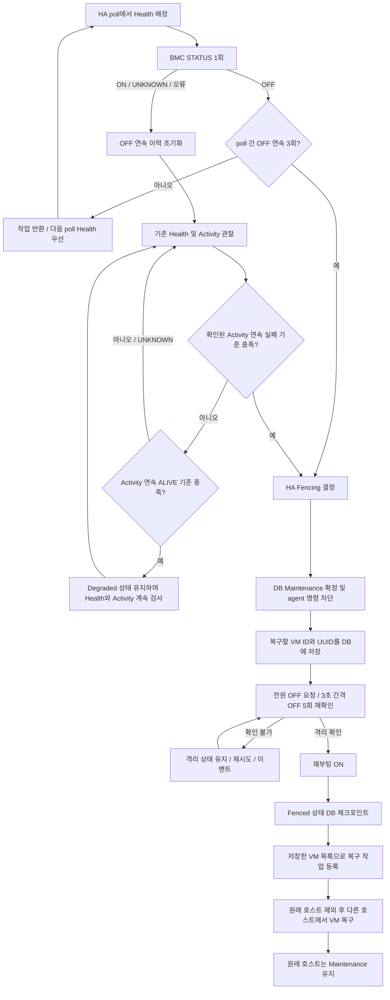

# Europa HA 감지 및 재부팅 복구 구현계획서

> 현재 구현 전체 흐름과 설정은 [Europa HA 현재 구현 구조와 설정](europa-ha-current-flow.md)을 참고한다. 1절은 최초 검토 당시의 운영 기준 동작이며, 이후 절은 추가 합의한 poll당 BMC 1회 감지까지 반영한 계획이다. 과거 검증과 이번 변경의 검증은 별도로 기록한다.

- 기준: `europa-2026`, 검토 시작 HEAD `1fcb1b0467`
- 구현 작업 브랜치: `codex/ha-safety` (운영 브랜치와 분리)
- 전원 정책: 사용자 선택에 따라 **재부팅 유지**. 부팅 후에도 Maintenance를 유지하고 VM은 다른 호스트에서 복구한다.
- 범위: Mold 코드 구현, 자동화된 회귀 검증, 현장 인수시험 절차. 현장 PCS 설정 변경과 실제 호스트 전원 조작은 이 로컬 구현에 포함하지 않는다.

## 1. 최초 검토한 운영 기준 흐름

`Health 실패 → Suspect → Activity 검사 → 연속 실패 임계값 → Recovering → Fencing → 전원 CYCLE → VM 복구 예약 → Maintenance`

1. RBD/GFS/CLVM은 마지막 HB가 기본 60초 이내면 ALIVE로 반환한다. NFS Activity에는 별도 61초 상수가 있다.
2. 7회·50%는 연속 실패 4회 기준이다. 초기 성공 4회가 나오면 남은 3회로 기준을 채울 수 없다는 이유로 Degraded에 들어가 기본 60초를 더 기다린다. 9회·50%는 연속 실패 5회다.
3. HA 전체 poll 간격과 Activity 간격은 별개이며, 실제 검사 주기는 poll에 영향을 받는다.
4. BMC STATUS 응답이 최신 driver 결과 대신 이전 DB 전원 상태를 담을 수 있다. Redfish의 PoweringOff도 Off로 해석한다.
5. 현재 fencing은 Unknown을 성공으로 반환하고 Off이면 ON, 그 외에는 CYCLE을 실행한다. 명령 성공이 실제 격리 증거로 사용된다.
6. VM 재시작 예약이 Maintenance보다 앞서며, 원래 호스트를 명시적으로 배치에서 제외하지 않는다.
7. 작업 timeout, 지연된 결과, 중복 Recovery/Fence 제출 및 관리 서버 재시작 사이의 처리를 함께 보완해야 한다.

## 2. 변경 후 안전 조건

- 조회 실패, timeout, 인증 오류, 응답 파싱 실패는 UNKNOWN이다. ALIVE나 확인된 DEAD 표본으로 변환하지 않는다.
- Ping 또는 libvirt 연결 실패 횟수만으로 완전 다운을 확정하지 않는다.
- 조기 감지는 Health 작업당 BMC STATUS를 한 번만 조회하고, 서로 다른 poll에서 **연속 OFF 3회**를 누적한다. On, Unknown, 오류가 끼면 OFF 확인은 성립하지 않는다. 작업 안에서 간격 대기로 worker를 점유하지 않는다.
- OFF 1~2회에서는 일반 agent Health를 생략하고 다음 poll의 Health를 우선한다. 최초 OFF에서 Available은 Suspect로 전환해 관찰 소유권을 확보하며, 기존 Suspect/Degraded는 유지한다. 오래된 OFF 증거, 다른 소유권·provider의 증거, 관리 서버 재시작 전 이력을 합쳐 장애를 확정하지 않는다.
- 기존 Activity 실패 임계값 7/50%=4회, 9/50%=5회를 유지한다. 초기 성공 때문에 관찰을 중단하지 않는다.
- Health가 비정상인 동안 Activity가 설정한 횟수 연속 ALIVE이면 Degraded로 진입한다. Degraded 상태에서도 주기적 검사를 계속하며, Activity 성공만으로 Available로 복귀하지 않는다.
- VM 복구보다 먼저 DB Maintenance를 확정하고, 연결된 agent에도 명령 차단을 적용한다.
- 전원 명령의 성공 응답만으로 격리됐다고 판단하지 않는다. OFF 단계와 실제 OFF 확인을 거친 뒤 재부팅 ON을 수행한다.
- 부팅·재접속으로 Maintenance를 자동 해제하지 않는다. HA 복구 배치에서는 원래 장애 호스트를 명시적으로 제외한다.
- 상태 전이 실패 또는 오래된 작업 결과가 VM 복구, 전원 동작, HA 비활성화로 이어지지 않도록 한다.

## 3. 구현할 흐름

재부팅 성공과 VM 복구 작업 등록은 재진입을 고려한다. ON 실패나 관리 서버 재시작이 발생했을 때 이미 확인한 격리·복구 단계를 어떻게 재개할지 코드와 테스트에서 명시한다.

구현 중 추가 확인: agent의 재부팅 상태 보고가 VM의 `host_id`를 지울 수 있으므로, 전원 조작 전에 `host_details`에 VM별 ID·UUID를 보존한다. 복구 작업은 `HostFenced` 사유와 원래 호스트 ID를 가진 DB 작업으로 먼저 등록한 뒤 VM stop 상태 정리를 수행한다. Fenced 이후 재시도는 전원 조작을 반복하지 않고 복구 작업 등록을 재개한다.

## 4. 구현 묶음과 대상

| 묶음 | 변경 내용 | 주요 대상 |
|---|---|---|
| A. 전원 증거 | STATUS 단일 조회, fresh 결과 반환, 전환 중 상태 구분, timeout·null 처리 | OOBM service, IPMI/Redfish driver 및 client |
| B. 빠른 확인 | 각 Health 작업에서 STATUS 1회, poll 간 OFF 3회 누적 후 별도 HA 이벤트. OFF 누적 중 다음 Health 우선, 오류·장기간 간격·소유권 변경 시 초기화 | KVMHAProvider, KVMHAConfig, HAResourceCounter, HAConfig, HealthCheckTask, HAManagerImpl |
| C. 지속 관찰 | 초기 성공에 따른 Degraded 대기 제거, 연속 실패 보존, UNKNOWN 제외, 이벤트 문구 정리 | ActivityCheckTask, HAResourceCounter, KVM HA 설정 설명 |
| D. 작업 순서 | 같은 호스트 작업 중복 억제, 현재 상태·소유권·작업 세대 확인, timeout 이후 늦은 결과 차단 | BaseHATask, HAManagerImpl, Health/Recovery/FenceTask |
| E. 격리와 복구 | Maintenance 선행 및 성공 검증, fencing 중 자격 예외, OFF 확인 후 ON, 원래 호스트 배치 제외 | HAAbstractHostProvider, KVMHAProvider, VM HA manager, deployment planner |
| F. Activity 정확성 | 명시적 ALIVE/DEAD/UNKNOWN 전달, 초/밀리초 오류 수정, 오류를 정상으로 반환하지 않음 | Activity command/answer/wrapper, LibvirtStoragePool, 관련 scripts |

기존 사용자가 수정한 `KVMHostActivityChecker`의 null guard와 별도 작업 파일은 보존한다.

## 5. 설정 및 호환성

- `max.attempts`와 `failure.ratio` 키 및 임계값 수식은 유지한다. 고정된 배치 검사 후 대기하는 의미는 지속적인 연속 실패 관찰로 바뀌며 설정 설명도 변경한다.
- `kvm.ha.degraded.max.period` 키는 호환성을 위해 남기지만, 지속 관찰에서는 이 대기 시간을 적용하지 않는다. Health와 Activity를 교대로 수행하므로 실제 Activity 간격은 설정값보다 길어질 수 있다.
- `kvm.ha.activity.check.success.threshold` 기본값 3은 Degraded 진입에 필요한 연속 ALIVE 횟수다. 클러스터별 양의 정수로 설정한다. DEAD와 UNKNOWN은 ALIVE 연속성을 끊고, UNKNOWN은 DEAD 연속성도 끊는다.
- Degraded 재검사는 DB 상태를 Suspect/Checking으로 바꾸지 않고 진행한다. 다음 단계가 확정되기 전까지 마지막으로 확인된 Degraded 상태를 유지한다. 정상 Health가 확인되면 Available로 복귀하고 양쪽 Activity 카운터를 초기화한다.
- HB 60초를 일괄적으로 낮추지 않는다. 기존 storage 보호 여유는 유지하고, 확실한 OFF에 별도 조기 경로를 추가한다.
- 조기 OFF 감지는 Health 작업당 STATUS 1회와 poll 간 누적을 사용한다. 감지 확인 횟수와 펜싱 단계의 반복 확인 횟수를 분리한다. 전원 확인의 3초 간격은 펜싱 검증에서만 사용한다.
- 전체 HA poll 기본값은 최초 60초에서 5초로 변경한 뒤, 이번에는 10초로 조정한다. 현장에 저장된 `ha.checking.interval` override는 자동으로 덮어쓰지 않는다. 기존 설치에서는 실제 저장값과 BMC·agent 부하를 함께 확인한다.
- BMC에도 전원이 없거나 관리망이 끊긴 경우에는 60초 미만 확정을 보장하지 않는다. 이 경우 UNKNOWN과 기존 관찰·fencing 확인 절차를 유지한다.
- 관리 서버·KVM agent·HA 스크립트를 함께 갱신해야 한다. 구형 agent의 일반 Answer는 명시적 관찰 결과를 구분할 수 없어 UNKNOWN으로 처리한다.
- CLVM의 이웃 호스트 로컬 프로세스 목록은 장애 호스트의 VM 정지를 입증할 수 없다. HB 만료 이후 이 검사만으로 DEAD를 반환하지 않는다. BMC OFF 증거도 없으면 복구가 지연될 수 있다.
- Redfish `OFF`는 강제 전원 차단인 `ForceOff`, `SOFT`는 `GracefulShutdown`으로 구분한다. 커널 정지 상태의 fencing에도 실제 OFF 단계가 필요하기 때문이다. 이 매핑은 OOBM API의 OFF 요청에도 적용된다.

### 추가 설정의 기본값

| 키 | 기본값 | 의미 |
|---|---:|---|
| `kvm.ha.power.off.check.enabled` | true | HB 만료 전 poll 간 OFF 누적 감지 경로 |
| `kvm.ha.power.off.confirmations` | 3 | 서로 다른 Health 작업에서 누적할 감지 횟수. 허용 최소값은 3회 |
| `kvm.ha.power.off.max.interval` | 60초 | 성공한 OFF 관찰 사이에 허용할 최대 간격. 초과하면 현재 OFF부터 다시 누적하며, 대기시간이 아님 |
| `kvm.ha.fence.power.off.confirmations` | 5 | OFF 요청 뒤 펜싱 검증에 필요한 반복 OFF 횟수 |
| `kvm.ha.power.check.interval` | 3초 | 펜싱 검증에서만 이전 STATUS 완료 후 다음 조회까지 최소 간격 |
| `kvm.ha.power.check.timeout` | 1초 | 실시간 BMC STATUS 한 번의 제한 시간 |
| `kvm.ha.health.check.timeout` | 20초 | STATUS 1회 및 필요한 일반 Health 처리를 위한 작업 제한시간. 기존 20초 유지 |
| `kvm.ha.activity.check.success.threshold` | 3 | Health 비정상 중 Degraded 진입에 필요한 연속 ALIVE 횟수 |

조기 감지는 Health 작업당 1회 조회이므로 Health 시간 예산에 3초 대기 4번을 더하지 않는다. OFF 1~2회 응답 후 agent Health를 생략하고 worker를 반환한다. ON·UNKNOWN 뒤에는 일반 Health가 이어질 수 있으므로 전체 Health가 1초 안에 끝난다는 의미는 아니다. OFF 응답 사이 60초 초과, ON·UNKNOWN·오류, 소유권·provider 상실이나 새 HA 주기는 감지 연속성을 초기화하며 관리 서버 재시작 후에도 0부터 센다.

펜싱 검증의 기본 예산은 별도로 `5회 × 1초 + 4회 × 3초 = 17초`다. Fence timeout 60초는 OFF·ON 요청과 종료 여유를 포함한 `17 + 21`초보다 크다. 이 단계의 반복 검증과 감지 증거 재사용 여부는 변경하지 않는다.

기존 DB에 저장된 설정값은 자동으로 덮어쓰지 않는다. 감지 횟수가 5회로 저장돼 있다면 새 소스 기본값 3회로 자동 변경되지 않는다. 잘못된 조합은 조기 확정 또는 전원 조작을 진행하지 않는다. 조회 timeout 1초보다 BMC 응답이 느리면 UNKNOWN으로 처리되어 조기 감지나 fencing 완료가 지연될 수 있다. 빠른 감지 시간에는 poll 대기, 작업 대기열, BMC 응답 시간이 추가되므로 고정된 몇 초 이내라는 SLA로 해석하지 않는다.

OFF 최대 허용 간격 60초는 실제 poll·대기열 지연보다 충분히 길어야 한다. 기존 poll이 60초 이상으로 저장돼 있으면 최대 간격 60초를 그대로 조합했을 때 조회 지연만으로 연속성이 끊길 수 있다. 기본 조합 10초 / 60초와 현장 저장값을 대조한다.

## 6. 자동 검증 항목

| 시나리오 | 필수 결과 |
|---|---|
| 7회·50%, SSSSFFFF | 4회 성공 후 대기하지 않고 연속 실패 4회에서만 복구 |
| 9회·50%, SSSSFFFFF | 연속 실패 5회에서 복구 |
| FFSFFF | 중간 성공으로 실패 연속성이 끊겨 복구하지 않음 |
| Ping/BMC/Activity timeout 또는 오류 | 확인된 DEAD 표본 및 OFF 확정으로 집계하지 않음 |
| cached Off + fresh On | 조기 장애 확정 금지 |
| cached On + 반복 fresh Off + 60초 이내 HB | 조기 fencing 경로 가능 |
| OFF 관찰 중 On/Unknown/오류 | OFF 확정 취소 |
| 서로 다른 Health 작업의 OFF, OFF, OFF | 각 작업은 STATUS 1회만 실행; 세 번째에만 Fencing |
| OFF 1~2회 및 Activity 재검사 예정 | 일반 agent Health 대기 없이 작업 종료, 다음 poll Health 우선 |
| OFF 사이 최대 허용 간격 초과 / 소유권·provider 변경 | 이전 증거를 합치지 않고 새로 누적 |
| OFF 확인 진행 중 HA 비활성화·재시작 | 이전 주기의 연속 카운터를 재사용하지 않음 |
| Redfish PoweringOff | 완전 OFF로 취급하지 않음 |
| Maintenance 저장 실패 | 전원 조작과 VM 복구 작업 등록 없음 |
| 전원 명령 성공, 실제 OFF 미확인 | VM 복구 시작 없음 |
| 빠른 재부팅·agent 재접속 | Maintenance 및 VM Start 차단 유지 |
| 이전 호스트가 Up | HA 배치에서 이전 호스트 제외 |
| 같은 호스트에 중복 poll | 동시 Recovery/Fence 실행 없음 |
| timeout 뒤 늦은 결과 / disable 후 결과 | 새 HA 주기에 영향 없음 |
| Fenced 상태 전이 또는 VM 작업 등록 실패 | 격리를 유지하고 재진입 가능 |
| 관리 서버 재시작 | DB Maintenance 보존; 미완료 fencing/복구 작업을 안전하게 재개 |
| OFF 뒤 HA 비활성화·소유권 변경 | 오래된 작업의 ON 및 복구 완료 처리 차단 |
| 재부팅 후 VM host_id 초기화 | 전원 조작 전 저장한 VM 목록으로 복구 작업 등록 |

변경 모듈과 의존 모듈을 컴파일하고 대상 JUnit/Mockito 테스트 및 변경 shell script 테스트를 실행한다. 자동 테스트 통과와 실제 PCS·BMC·스토리지 인수시험 완료는 구분하여 보고한다.

## 7. 현장 인수시험

1. 정상 운용, 일시적인 관리망 손실, 전체 관리망 단절, BMC만 단절, 스토리지 지연을 각각 시험한다.
2. 전원 OFF와 커널 정지, PCS 선행 재부팅을 별도 시험한다.
3. 감지 시작, BMC 관찰, Maintenance 확정, OFF 확인, ON, VM 작업 등록, 대상 호스트 Start 시각을 대조한다.
4. 어떤 경우에도 동일 VM이 두 호스트에서 동시에 실행되지 않아야 한다.
5. PCS/libvirt 등 Mold 밖의 자동 시작 정책은 별도 확인한다. Mold의 배치 차단만으로 외부 실행 주체까지 통제한다고 가정하지 않는다.
6. 여러 관리 서버 간 소유권 이전과 OFF/ON 도중 관리 서버 강제 종료를 시험한다. 외부 BMC 명령과 DB 갱신은 하나의 원자적 트랜잭션이 아니므로, ON 성공 직후 Fenced 저장 전 프로세스가 종료되면 다음 시도에서 전원 시퀀스가 반복될 수 있다. 전원 명령의 정확히 한 번 실행을 보장하지 않는다.

## 8. 진행 상태와 검증 단계

- [x] 현재 HA 전체 호출·상태 흐름 검토
- [x] 사용자 전원 정책 확인: 재부팅 유지
- [x] 구현 전 계획 공개
- [x] 코드 구현
- [x] 최초 변경의 회귀 테스트 및 모듈 빌드: 42개 모듈 성공, Java 250개·스크립트 14개 통과
- [x] 최종 차이 검토와 [검증 결과 기록](europa-ha-safety-validation.md)
- [x] poll당 1회 BMC 조회·연속 OFF 3회 변경: 43개 모듈 성공, Java 236개 통과 (실패·오류·제외 0개). 최초 단계와 별도로 검증했다.
- [ ] 현장 인수시험 (운영 환경에서 별도 수행)
