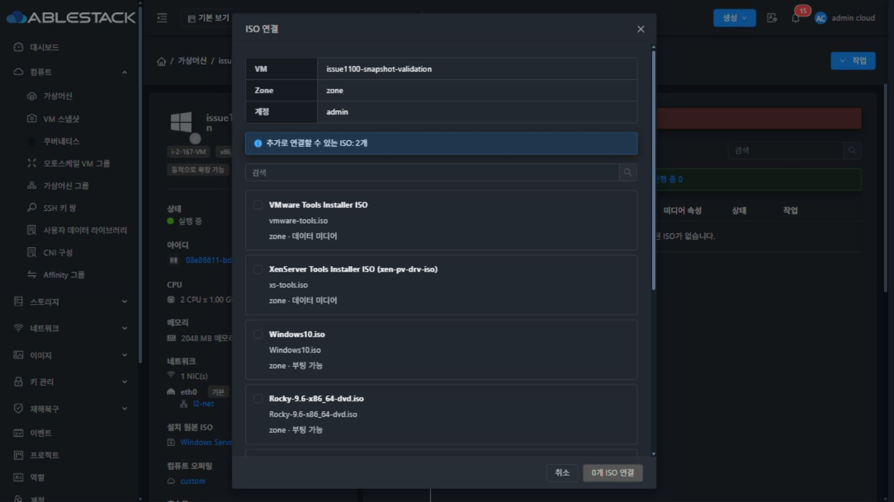
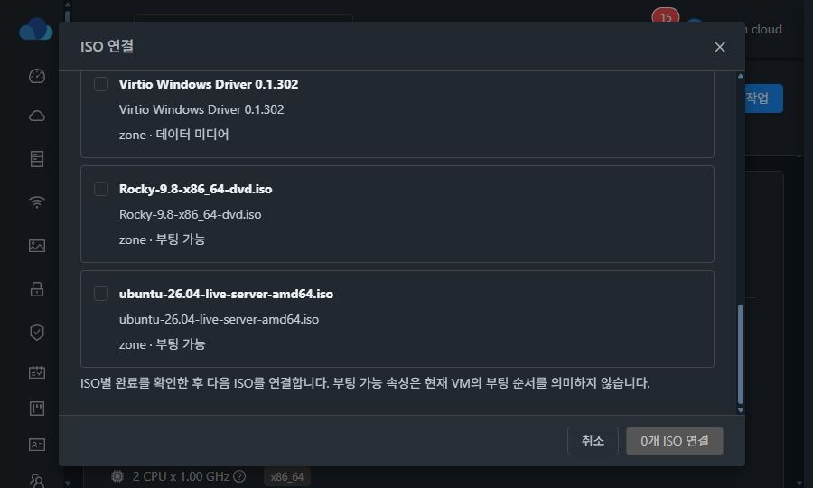

# VM ISO 관리 개선 검증 — #1124

## 변경 내용

- ISO 0개에서도 ISO 탭을 유지하며 연결·선택 해제·업데이트·검색을 제공합니다.
- 행의 대표 작업은 연결 해제 버튼이며 추가 메뉴에는 상세를 표시합니다.
- 연결·해제·상세·작업 결과 대화상자는 화면 중앙에 배치하고 제목과 하단 버튼을 고정하며 본문만 스크롤합니다.
- ISO별 비동기 작업이 완료된 후 다음 요청을 제출합니다. 성공·명시적 실패·결과 미확인·미제출을 구분하며 결과가 불명인 요청을 다시 제출하지 않습니다.
- 좌측 정보 카드에 연결된 ISO 전체를 표시하고 설치 원본 ISO와 구분합니다.
- 기존 API만 사용합니다. 서버 수정은 동일 VM의 ISO 작업에 대한 분산 잠금 및 잠금 안의 최신 슬롯 검증으로 한정합니다.

## 원인 및 서버 수정 범위

기존 다중 선택 화면은 POST 접수 후 다음 ISO를 제출하고 전체 job 완료를 기다리지 않았습니다. 13번 환경의 기존 작업 2757/2758은 겹쳐 실행되고 모두 성공으로 기록됐지만 DB와 libvirt에는 하나만 남아 있었습니다. API 명령의 동기화 키 선언만으로 실제 실행 경로 전체가 직렬화되지 않았습니다.

`TemplateManagerImpl.attachISOToVM`에서 VM별 GlobalLock을 얻은 뒤 최신 VM/연결 목록 조회, 개수·중복 검증, 슬롯 선택, 에이전트 실행, DB 반영을 수행합니다. 잠금 실패 시 변경하지 않습니다. 해제 시에도 요청 ISO가 아직 연결되어 있는지 다시 확인하여 오래된 요청이 다른 ISO를 해제하지 못하도록 했습니다. 새 API, 스키마 또는 호스트 에이전트 변경은 없습니다.

VM 응답의 보조 슬롯 `bootable=false`는 미디어 자체의 부팅 가능 여부와 달랐습니다. 화면은 기존 `listIsos` 메타데이터로 미디어 속성을 조회하고 조회할 수 없으면 미지정으로 표시합니다. 장치는 API의 슬롯 번호로 표시합니다. IDE 이름을 가정하지 않습니다.

## 빌드 및 자동 테스트

WSL ext4 작업 경로: `/home/ablecloud/work/dhslove/cloud-iso-1124`.

| 검증 | 결과 |
| --- | --- |
| `TemplateManagerImplTest` | 66개 통과, 실패/오류 0 |
| ISO UI 유틸리티·배치·메타데이터 테스트 | 3개 suite, 16개 통과 |
| 변경 UI 파일 ESLint | 통과 |
| server Maven 모듈 package | 성공 |
| UI production build | 최종 소스 `cda6a60cf17` 빌드 성공 |

로컬 의존성 정합화를 위해 api/core/engine-components-api 모듈을 install한 뒤 server 모듈을 빌드했습니다. 전체 Cloud 빌드나 GitHub Actions 전체 CI를 실행한 결과가 아닙니다.

자동 테스트는 순차 terminal 완료, 부분 실패 후 실패 항목만 재시도, 불명 job 재조회, job ID 없는 응답/통신 실패의 재제출 방지, 중복 실행 방지, 보안 범위 변경, legacy/보조 슬롯 응답, 미디어 조회 실패/지연 응답, 잠금 실패와 stale detach를 포함합니다.

## 13번 클러스터 기능 검증

전용 기존 검증 VM `issue1100-snapshot-validation`을 사용했습니다. 사용자 W2025-Base VM의 연결은 변경하지 않았습니다.

| 시나리오 | 확인 결과 |
| --- | --- |
| Stopped/ISO 0개에서 두 API 요청 동시 제출 | 두 job 성공, 서로 다른 슬롯 3/4 및 DB primary/secondary 유지 |
| UI에서 두 ISO 선택 연결 | 첫 job terminal 이후 다음 ISO 처리, 결과 성공 2, 탭/정보 카드 2개 표시 |
| Stopped에서 연결 후 VM 기동 | libvirt sdd/sde 두 CD-ROM에 서로 다른 ISO 실제 연결 |
| Running에서 primary만 해제 | primary 빈 상태, secondary ISO 및 sde 미디어 유지 |
| 마지막 secondary 해제 | 두 CD-ROM 빈 상태, ISO 탭·빈 상태·연결 버튼 유지 |
| Running/ISO 0개에서 UI 두 개 연결 | 두 job 성공, libvirt sdd/sde 모두 미디어 확인 |
| 최종 테스트 자원 복원 | UI에서 두 ISO 해제 후 검증 VM 정지. DB Stopped, iso_id NULL, vm_iso_map 0행, 호스트 실행 도메인 없음 |

대표 동시 제출 job: `3c7dedca-6278-468a-b793-b16c8f37fb82`, `56eb35b1-55a5-4dc7-9c64-bfb099fb5b7c`.
Running UI 연결 job: `b8a6a85f-8530-4102-ace4-8989683211c1`, `9b465dfe-6ca1-4ebf-95f4-d45484b7485d`.

실제 실행 VM에서 Virtio ISO는 sdd, Rocky ISO는 sde에 연결됨을 `virsh domblklist`로 확인했습니다. API 성공 메시지나 DB 행만으로 완료를 판정하지 않았습니다.

## 다크모드 및 배치 검증

실제 브라우저에서 발견한 문제를 수정했습니다.

- 설명 표의 레이블 배경이 흰색으로 남아 밝은 글자가 보이지 않음: 테마 배경·글자·테두리 토큰 적용.
- ISO 선택 목록이 체크박스 그룹의 검정 글자색을 상속함: 목록 제목은 기본 텍스트 토큰, 안내 문구는 보조 텍스트 토큰을 직접 적용하고 opacity 중첩 제거.
- 좁은 탭 영역에서 우측 고정 작업 열이 앞 열을 덮음: 열 너비와 수평 스크롤을 유지하되 고정 열을 제거.
- 설명 레이블 폭, 좌우 본문 여백, footer 버튼 간격을 통일.

최종 배포본에서 아래를 직접 확인했습니다. 측정 원본은 [ui-measurements.json](ui-measurements.json)입니다.

- 다크 ISO 제목 `rgb(240,243,246)`, 보조 설명 `rgb(197,204,212)`, 레이블 배경 `rgb(22,27,34)`. 라이트 제목 `rgb(31,41,55)`, 보조 설명 `rgb(75,85,99)`.
- 레이블 폭 128px, 600px 화면에서는 96px. 연결/해제/상세/결과 대화상자를 다크·라이트에서 확인했습니다.
- 900×540 화면에서 대화상자 y=24, 높이=492로 세로 중앙 오차 0px. 본문 scrollTop 0→854에서 header y=24, footer y=459가 그대로 유지됐습니다. 가로 중앙은 스크롤바를 제외한 modal wrap 기준입니다.
- 1600×900, 1280×720, 900×540, 600×600에서 확인했습니다. 좁은 표는 가로 스크롤하며 작업 메뉴에 정상 접근하고 열이 겹치지 않습니다. 긴 이름/UUID는 대화상자 안에 유지됩니다.
- ISO 2개 선택 시 추가 선택은 비활성화되고 선택 취소는 가능하며 글자도 읽을 수 있습니다.
- 실제 UI 재연결 최종 job `57aae73b-b168-4ddf-9d28-5fd7683d0570`, `d6e7cf07-777a-4710-9ea2-3ac0929083fa` 모두 성공. DB primary=208, secondary=210/slot4 및 libvirt sdd/sde와 일치했습니다.
- 기존 상단 작업 메뉴의 다중 선택 연결도 두 건 성공하며 전체 완료 후 닫히는 것을 확인했습니다.
- 최종 페이지 로드 후 기존 `Error fetching GUI theme` 메시지 2건은 남아 있습니다. 이전 UI에서도 확인된 메시지이며 ISO 동작 중 새 콘솔 오류는 없었습니다.

| 화면 | 증거 |
| --- | --- |
| 수정 전 검정 글자/흰 레이블 | [수정 전](00-before-dark.png) |
| 다크 ISO 탭 | [표와 작업](01-tab-dark.png) |
| 다크 상세/해제/결과 | [상세](02-details-dark.png), [해제](03-detach-dark.png), [결과](04-results-dark.png) |
| 수정 후 다크 연결 목록 | [연결](05-attach-dark.png), [낮은 화면 스크롤](06-low-dark-scroll.png) |
| 라이트 연결/결과/상세/해제 | [연결](07-attach-light.png), [결과](08-results-light.png), [상세](09-details-light.png), [해제](11-detach-light.png) |
| 좁은 화면 | [600px 상세](10-narrow-light.png) |
| 검증 후 정지·ISO 없음 | [복원 상태](12-empty-dark-restored.png) |

## 배포 및 복구

- 관리 서버: 13번 클러스터. 활성 경로 `/usr/share/cloudstack-management/webapp`.
- 원본 백업: `/root/iso-1124-20260918/management-before.jar`, `ui-before.tgz`.
- 서버: 기존 shaded JAR에서 빌드된 `TemplateManagerImpl.class` 한 엔트리만 교체했습니다. 다른 엔트리의 CRC가 동일함을 확인하고 mold를 재시작했습니다.
- 배포 JAR SHA-256: `8929bd4089e90a5a664bef62acc15ea45b40dd7a3b5270805d58c385373b7cd8`.
- UI: 정적 파일만 갱신하며 WEB-INF와 config.json을 보존합니다. 829개 파일 해시 일치, config.json 해시 보존, WEB-INF 존재, 서비스 PID 유지, mold active, `/client/` HTTP 200을 확인했습니다. UI 패키지 SHA-256은 `454279fc8c456840af2b7621f3c710a29c222626f25abe4c582aea189d3a5154`입니다.

## 검증 한계

검증 종료 후 브라우저 다크모드와 원래 viewport를 복원했습니다.

실환경 검증은 KVM입니다. VMware/기타 하이퍼바이저, 권한별 전체 조합, VM 신규 생성의 additionalisoids 경로는 이번 실환경 테스트에 포함하지 않았습니다. 부분 실패·통신 단절·결과 미확인 처리는 자동 테스트로 확인했으며 실제 클러스터에 장애를 주입하지 않았습니다.
