<!--
Licensed to the Apache Software Foundation (ASF) under one
or more contributor license agreements.  See the NOTICE file
distributed with this work for additional information
regarding copyright ownership.  The ASF licenses this file
to you under the Apache License, Version 2.0 (the
"License"); you may not use this file except in compliance
with the License.  You may obtain a copy of the License at

  http://www.apache.org/licenses/LICENSE-2.0

Unless required by applicable law or agreed to in writing,
software distributed under the License is distributed on an
"AS IS" BASIS, WITHOUT WARRANTIES OR CONDITIONS OF ANY
KIND, either express or implied.  See the License for the
specific language governing permissions and limitations
under the License.
-->

# Europa NIC UI 검증 기록

최신 중앙 정렬 수정과 배포 결과는 [중앙 정렬 후속 검증](centering.md)을 참조한다. 아래 내용과 기존 스크린샷은 최초 기능 검증 시점의 기록이다.

대상 이슈: ablecloud-team/ablestack-cloud#1118. 변경 범위는 UI이며 기존 Cloud API만 사용한다.

## 변경 내용

- 볼륨 탭과 같은 목록/작업 구성으로 생성 및 연결, 기존 네트워크 연결, 연결 해제, 기본 NIC, 상태, IP/MAC, 보조 IP, 상세를 제공한다.
- 모든 NIC 대화상자는 제목과 하단 버튼을 고정하고 본문만 스크롤한다. 생성 폼의 고정 폭을 제거해 입력/선택 컴포넌트가 본문 폭에 맞게 정렬된다.
- 생성/연결 대상은 가상머신, Zone, 계정 또는 프로젝트, 도메인을 구분해 표시한다. 안내문과 오류는 테마 색상을 사용한다.
- 동일한 KVM 인터페이스를 변경하는 `updateVmNic`와 `UpdateVmNicLinkState`를 중복 노출하지 않는다. KVM에서는 전자를 우선 사용하고, 권한/환경에 따라 후자를 사용한다. 상세 메뉴는 항상 마지막이다.
- 실행 중 MAC 변경은 기존 API가 DB만 변경하고 호스트 MAC을 갱신하지 않아 정지 VM에서만 허용한다. 서비스가 있는 네트워크의 IPv4 변경도 기존 API 제약대로 정지 상태를 요구한다.
- 비동기 작업 완료 후 NIC를 재조회해 반영 여부를 확인한다. 응답 유실 시 중복 생성/요청을 보내지 않으며, 부분 성공한 네트워크는 보존한다.

## 실동작 검증

테스트 클러스터 13의 전용 검증 VM에서 Chrome UI로 동작을 실행했다. 개발 UI는 동일 클러스터 API 프록시를 사용했고, 최종 정적 UI 배포 후 브라우저 검증을 추가했다.

| 검증 | 결과 |
| --- | --- |
| L2 신규 네트워크 생성 및 VM 연결 | UI 단계 완료, 호스트의 VLAN 브리지 및 NIC 생성 확인 |
| Shared 신규 생성 및 연결 | UI 2단계 완료, NIC 목록 반영 확인 |
| 기존 격리 네트워크 연결 | UI 완료, IPv4/MAC 표시 및 NIC 조회 확인 |
| 연결 해제 | UI 완료, 기본 NIC 보존 및 대상 NIC 제거 확인 |
| 기본 NIC 변경 및 복원 | UI 완료, DB 기본 NIC 상태 변경/복원 확인 |
| NIC 비활성화/활성화 | UI 완료, 호스트 인터페이스 DOWN/UP 확인 |
| 정지 VM MAC 변경 후 시작 | UI 완료, 호스트 인터페이스 MAC 변경 확인 |
| 보조 IP 자동 할당 및 해제 | UI 완료, 할당 주소 표시 후 해제 확인 |

## 자동 검증

- 변경 파일 ESLint: 통과.
- NIC 및 기존 볼륨 관련 5개 테스트 스위트, 38개 테스트: 통과.
- 단위 테스트에는 권한/상태 제한, 생성/연결 단계, 부분 실패, 응답 유실 중복 방지, 로케일, 목록 갱신과 VM 전환을 포함한다.
- 전체 Cloud/Maven 빌드 및 전체 CI 결과를 의미하지 않는다. KVM 테스트 클러스터에서 UI 모듈 범위를 검증했다.

## 기존 서버 API 제한 (성공으로 판정하지 않음)

- Isolated IPv4 변경: UI에서 정지 VM의 주소를 `.171`에서 `.172`로 요청했다. 작업은 성공 응답이었지만 NIC 재조회 주소는 `.171` 그대로였다. UI는 완료로 처리하지 않고 결과 재확인 상태로 유지했다. `UserVmManagerImpl.updateNicIpForVirtualMachine`의 Isolated 경로는 IP를 계산하지만 `nicVO.setIPv4Address`는 Shared/Basic 분기에만 존재한다.
- Shared IPv4 변경: 전용 Shared 네트워크에서 요청한 주소가 한 번 할당된 뒤 같은 주소를 다시 할당하려다 job 2718이 530으로 실패했다. 관리 로그에서 첫 할당 성공과 두 번째 할당의 `requested ip ... is not available`을 확인했다. 소스에도 `allocatePublicIpForGuestNic`의 중복 호출이 있다.
- 신규 API나 서버 변경 없이 UI만 수정한다는 범위를 지켰다. 따라서 **IPv4 변경의 서버 동작은 본 PR에서 해결되지 않았으며**, 전체 기능 PASS로 보고하지 않는다. UI는 서버 실패와 미반영 결과를 표시하고 자동 중복 요청을 하지 않는다.
- 실패 경로에서 발견한 평면 로케일 키 노출과 NIC 취소 버튼의 볼륨 문구 재사용을 수정하고 회귀 테스트를 추가했다.

## 배포 및 시각 검증

- UI 빌드 커밋: `94389eb04b4` (이후 문서 및 줄바꿈 정리만 추가).
- WSL ext4 클론에서 UI 프로덕션 빌드 성공. 전체 Cloud 빌드는 실행하지 않았다.
- 아카이브 SHA256: `d9fd7d8cdda09d709fd606aad741820d1cc81dd39ddc48af7bb863a558c7576e`.
- 활성 webapp의 정적 파일 829개 해시 일치, WEB-INF 보존, config.json 해시 유지, mold active, 관리 PID 2917769 유지, 배포 전후 `/client/` HTTP 200.
- 정적 파일 원본 백업: `/root/nic-ui-backup-20260917-b9759782c86/static-before.tgz`.
- 생성(Isolated/L2/Shared), 기존 연결, 기본 설정, 활성/비활성, 주소 변경, 보조 IP 편집/해제, 상세, 진행 대화상자를 실제 UI에서 확인했다. 입력/선택 폭, 버튼 위치, 번역 및 다크/라이트 안내 색상을 확인했다.
- 기본 뷰포트 1680×881에서 생성 폼 헤더 y=24, 푸터 y=800은 본문 scrollTop 0→436 전후 동일했다. 생성 입력 폭 702px, 520px 대화상자의 입력 폭 472px.
- 1024×600에서는 생성 폼 헤더 y=24, 푸터 y=519. 480×640에서는 모달 폭 456px, 헤더 y=12, 푸터 y=571로 버튼이 화면 안에 유지됐다. 본문 clientWidth=scrollWidth로 가로 넘침이 없었다.
- 다크 안내문 `rgb(197, 204, 212)`, 라이트 안내문 `rgb(75, 85, 99)`로 테마에 따라 변경됨을 확인했다.
- 측정 자료: [layout-evidence.json](layout-evidence.json). 스크린샷은 본 폴더의 PNG 파일이다.

### 생성 및 연결

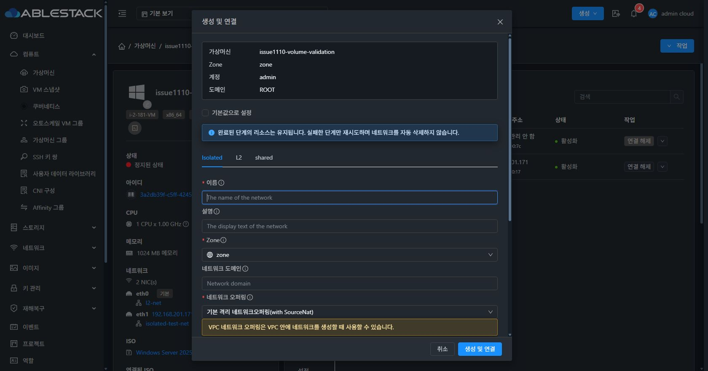
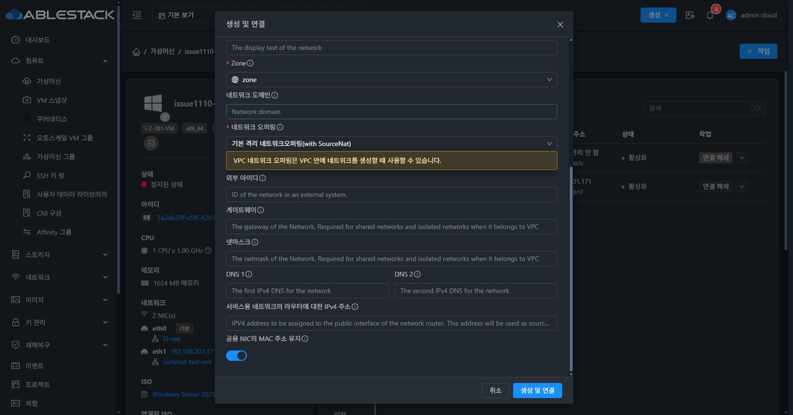
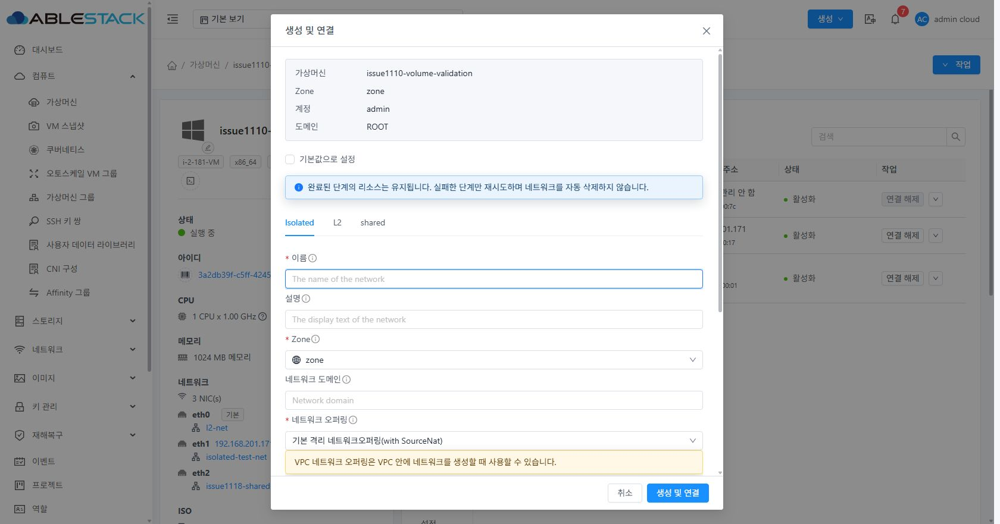
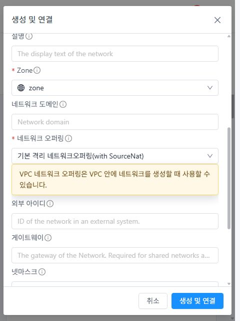

### 입력과 작업 메뉴

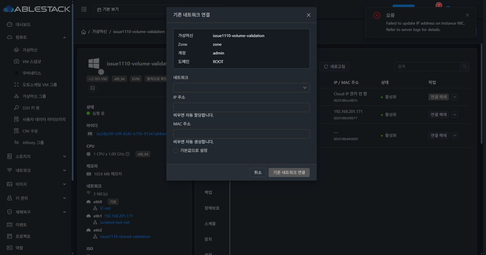
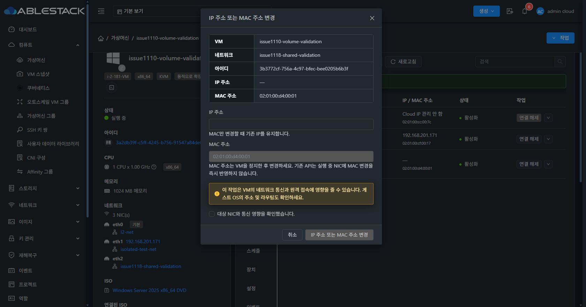
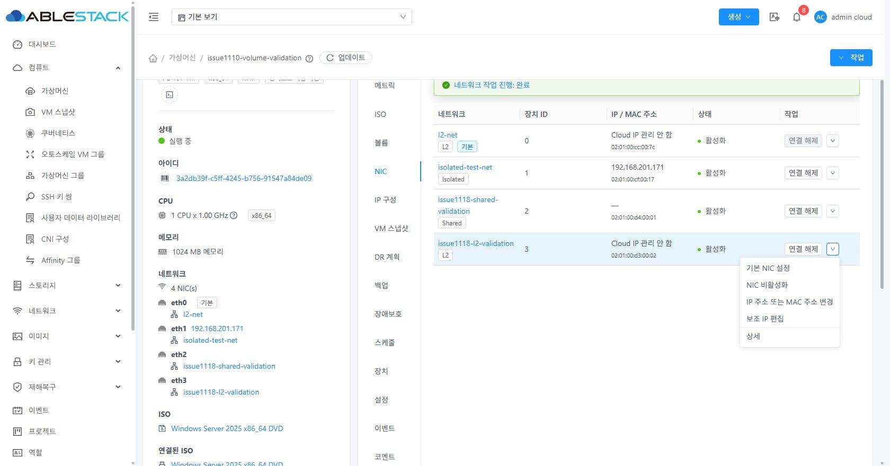
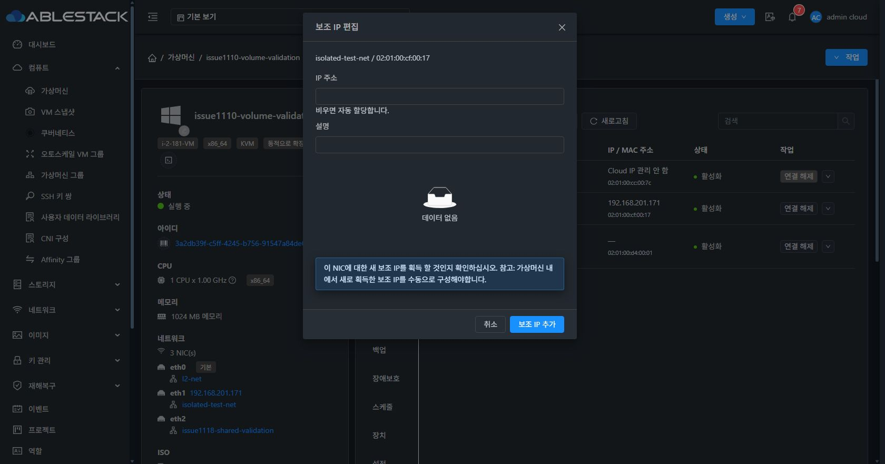
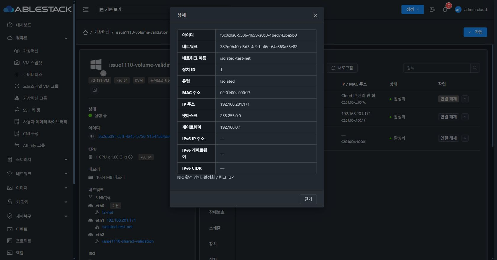

## 정리 결과

검증 VM은 Running으로 복원했고 원래 기본 NIC 한 개(device 0, MAC 유지, enabled/link UP)만 남아 있다. 기존 격리 네트워크는 보존했다. 이번 작업에서 만든 L2/Shared 네트워크 두 개는 연결 VM이 없음을 확인한 후 삭제했다.

Shared IPv4 API의 중복 할당 실패가 남긴 테스트 IP 한 건 때문에 정상 네트워크 삭제가 한 번 실패했다. 해당 IP의 네트워크 UUID/이름, 미사용 NIC 상태, NAT/VM 연결 부재를 검증하고 단일 행을 백업한 뒤 할당 필드만 해제했다. 이후 기존 deleteNetwork API로 삭제 및 부재를 확인했다. 이 조치는 테스트 리소스 정리이며 제품 서버 코드를 수정한 것이 아니다. 원본 백업은 관리 서버의 기존 배포 백업 폴더에 보관했다.

[최종 상태](final-state.txt), [정리 결과](cleanup-final.txt), [배포 결과](deployment-final.txt), [단위 테스트](unit-tests.txt), [lint](lint.txt).

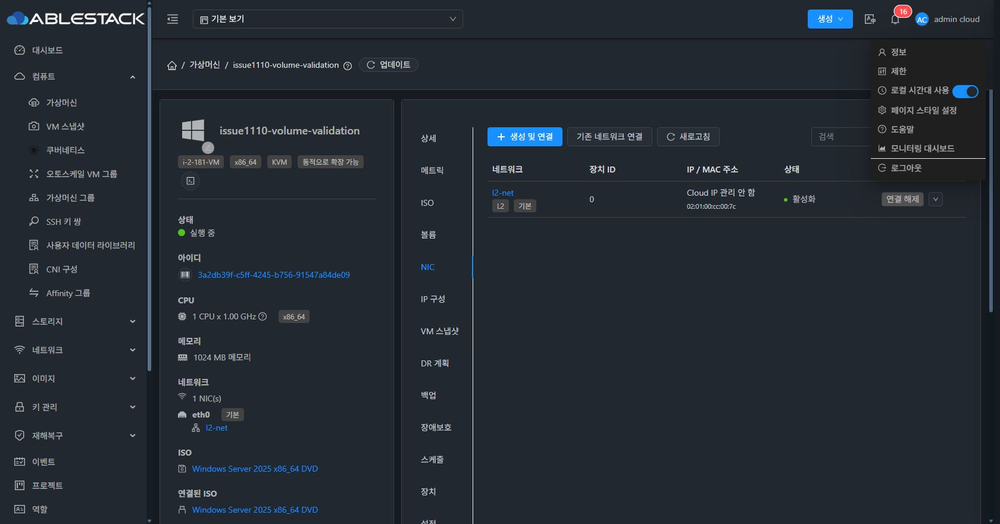
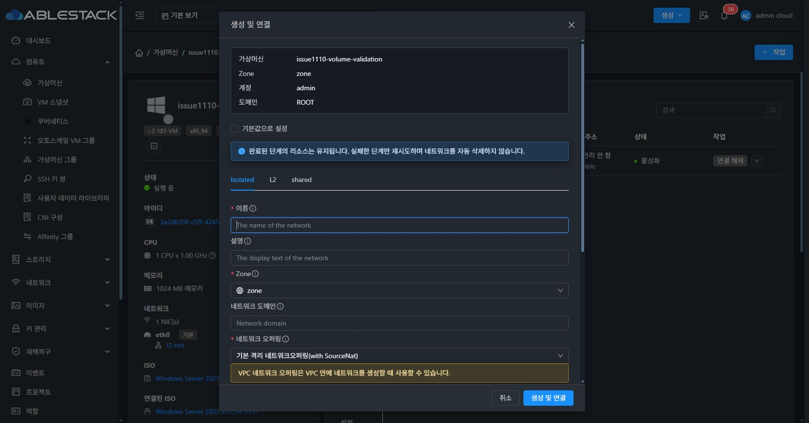
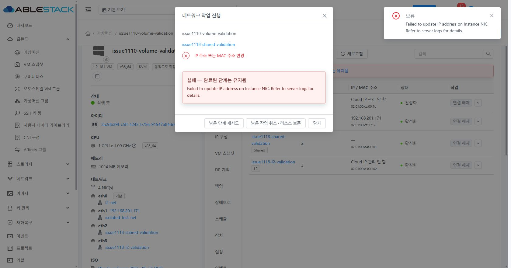
