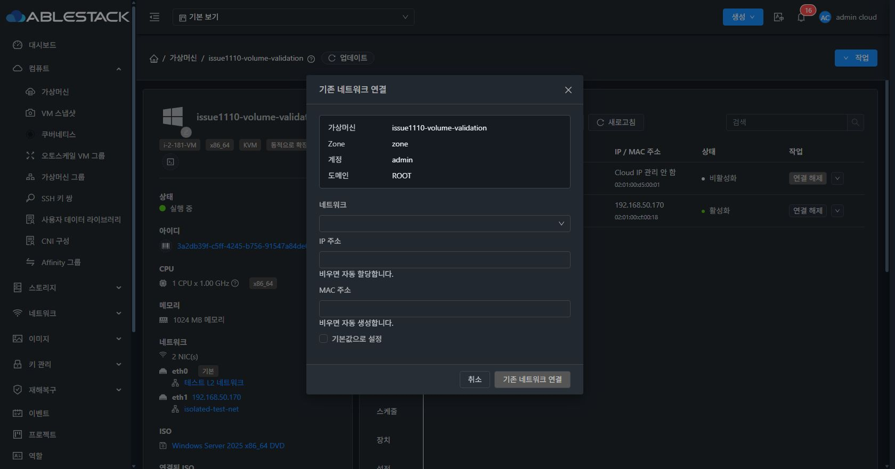
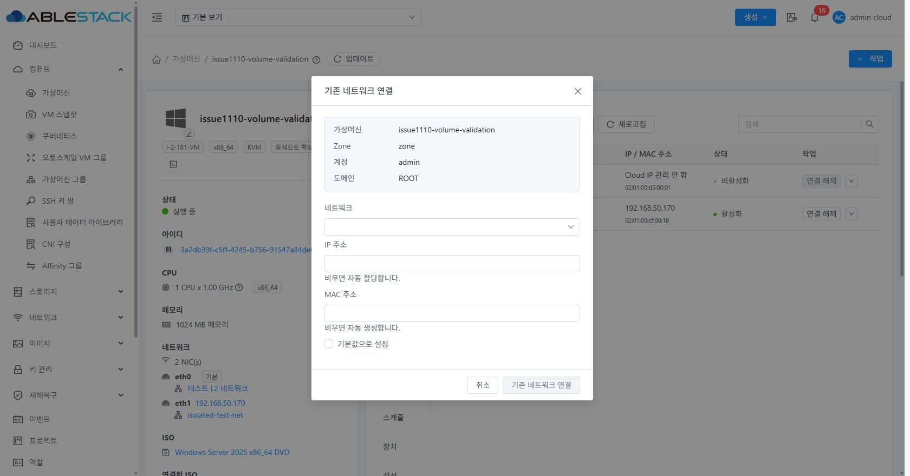
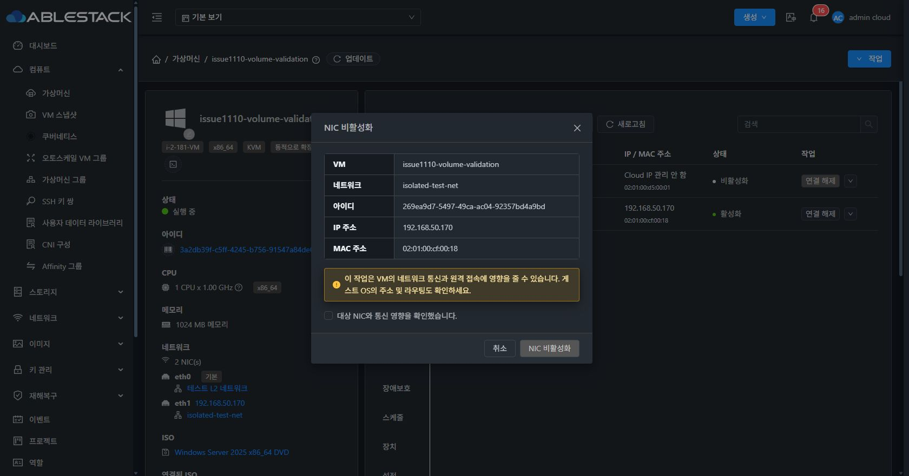
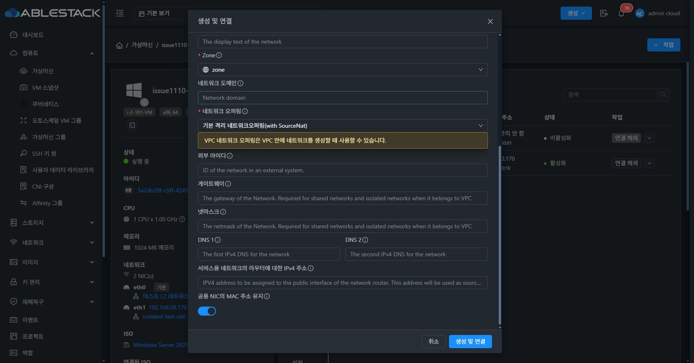
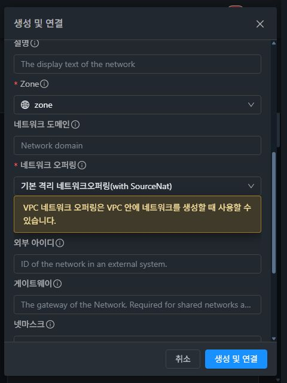

<!--
Licensed to the Apache Software Foundation (ASF) under one
or more contributor license agreements.  See the NOTICE file
distributed with this work for additional information
regarding copyright ownership.  The ASF licenses this file
to you under the Apache License, Version 2.0 (the
"License"); you may not use this file except in compliance
with the License.  You may obtain a copy of the License at

  http://www.apache.org/licenses/LICENSE-2.0

Unless required by applicable law or agreed to in writing,
software distributed under the License is distributed on an
"AS IS" BASIS, WITHOUT WARRANTIES OR CONDITIONS OF ANY
KIND, either express or implied.  See the License for the
specific language governing permissions and limitations
under the License.
-->

# NIC 대화상자 중앙 정렬 후속 검증

생성, 연결, 작업 확인, 보조 IP, 상세, 진행 대화상자 6곳에 Ant Design `centered`를 적용했다. 상단 24px/12px을 강제하던 규칙을 제거하고 `.ant-modal`의 `top: 0`을 적용했다. 제목과 하단 버튼 고정, 본문 스크롤과 화면별 최대 높이는 유지한다.

## 빌드와 배포

- UI 소스 커밋: `1dab7a989cb32ca1c8360b72e2739576990a8614`.
- WSL ext4 UI 프로덕션 빌드 및 해당 Vue 파일 ESLint 통과.
- 배포 파일: `nic-ui-1dab7a989cb.tgz`.
- SHA256: `e253742477c9241e064055d20a7029997152982ab61b87795e9f80f16dbf2133`.
- 클러스터 13 활성 webapp의 정적 파일 829개 해시 일치. WEB-INF, config.json 해시 및 관리 PID 보존. mold active, 배포 전후 `/client/` HTTP 200.

## 배포된 Chrome UI 측정

중앙 좌표는 스크롤바를 제외한 모달 래퍼 가용 폭과 브라우저 뷰포트 높이를 기준으로 계산했다. 아래 모든 수정 후 측정에서 수평/수직 중심 오차는 0px이다.

| 화면 | 뷰포트 | 대화상자 높이 | 위/아래 여백 |
| --- | --- | --- | --- |
| 기존 연결, 수정 전 | 1680×881 | 600px | 24px / 257px |
| 기존 연결, 다크/라이트 | 1680×881 | 600px | 140.5px / 140.5px |
| NIC 비활성화 확인 | 1680×881 | 464px | 208.5px / 208.5px |
| 보조 IP 편집 | 1680×881 | 620px | 130.5px / 130.5px |
| 상세 | 1680×881 | 679px | 101px / 101px |
| 생성 및 연결 | 1680×881 | 833px | 24px / 24px |
| 기존 연결, 라이트 | 1024×600 | 552px | 24px / 24px |
| 생성 및 연결, 다크 | 480×640 | 616px | 12px / 12px |

생성 폼 본문 scrollTop 0→436 전후 제목 y=24, 하단 버튼 영역 y=800은 동일했다. 긴 폼은 화면 높이를 넘지 않고 본문만 스크롤된다. 짧은 창은 내용 높이에 맞춰 화면 중앙에 표시된다. 좁은 화면에서도 제목과 취소/실행 버튼이 보인다.

이번 후속 검증은 창 열기·닫기·테마 변경·스크롤만 수행했다. VM/NIC/네트워크 변경 작업은 실행하지 않았다. 현재 사용자의 두 NIC 구성과 상태를 보존했다. 진행창에는 같은 중앙 정렬 옵션과 스타일을 적용했으며, 이번 배치 수정 검증에서는 실제 작업을 새로 실행해 진행창을 재현하지 않았다. 이전 기능 검증 결과는 README의 최초 검증 기록을 참조한다.

[전체 좌표 측정 JSON](centering-evidence.json)

## CI 범위

이 후속 변경의 UI 모듈 빌드, ESLint, 배포 UI 검증은 통과했다. 전체 Cloud 빌드는 별도로 실행하지 않았다. 커밋 `1dab7a989cb`의 GitHub 자동 검사에서는 RAT 라이선스 검사(미승인 파일 12개)와 pre-commit이 실패했고 다른 작업은 확인 당시 진행 중이었다. 전체 CI 성공으로 판정하지 않으며, 해당 실패의 기준 브랜치 비교는 이번 중앙 정렬 검증 범위에 포함하지 않았다.
