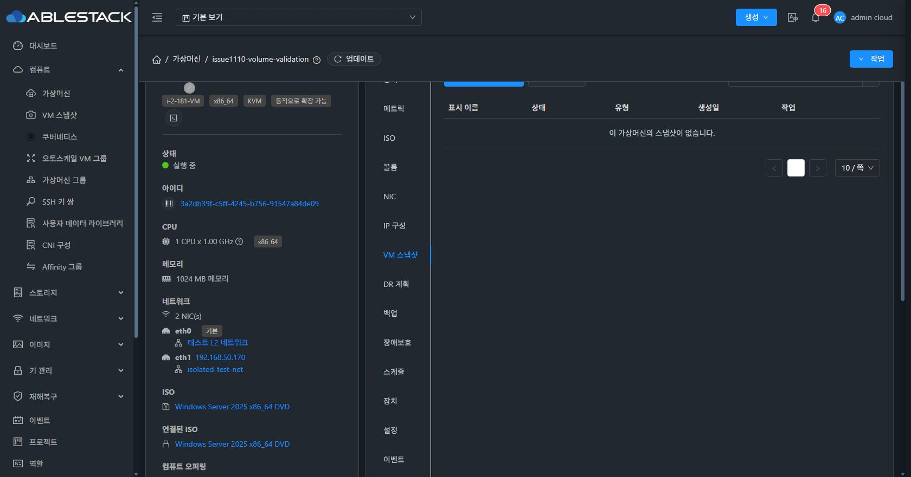
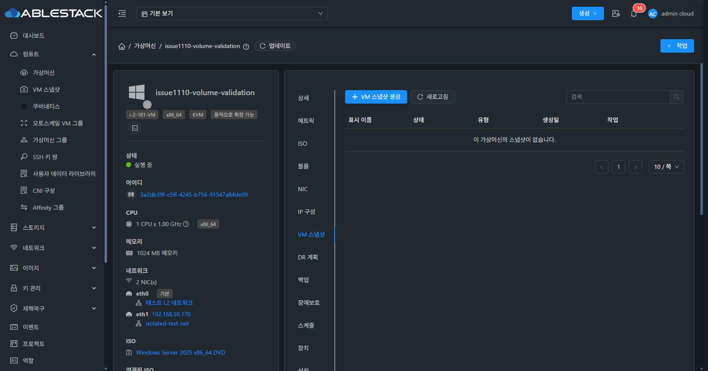
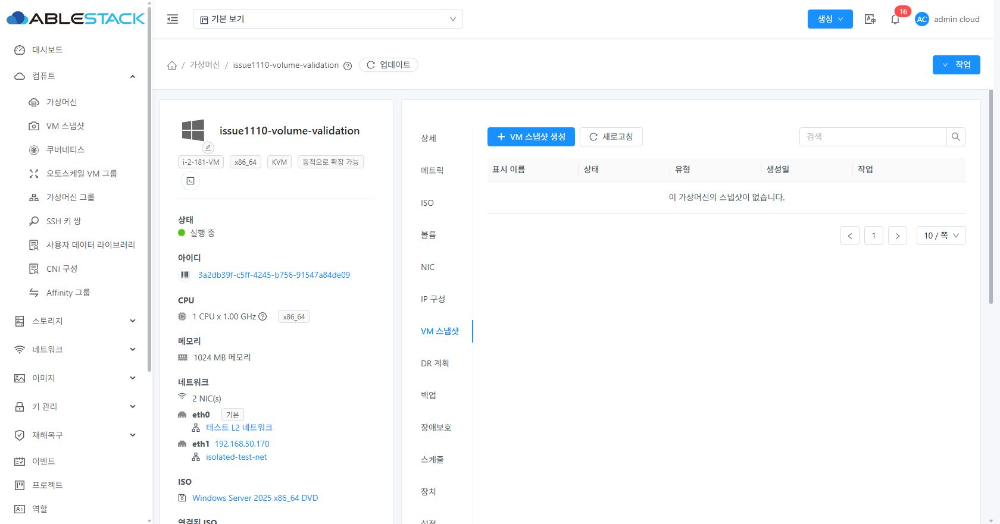
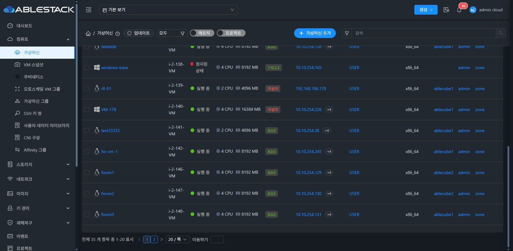

<!--
Licensed to the Apache Software Foundation (ASF) under one
or more contributor license agreements.  See the NOTICE file
distributed with this work for additional information
regarding copyright ownership.  The ASF licenses this file
to you under the Apache License, Version 2.0 (the
"License"); you may not use this file except in compliance
with the License.  You may obtain a copy of the License at

  http://www.apache.org/licenses/LICENSE-2.0

Unless required by applicable law or agreed to in writing,
software distributed under the License is distributed on an
"AS IS" BASIS, WITHOUT WARRANTIES OR CONDITIONS OF ANY
KIND, either express or implied.  See the License for the
specific language governing permissions and limitations
under the License.
-->

# VM 스냅샷 페이징 다크모드 검증

관련 이슈: ablecloud-team/ablestack-cloud#1120.

## 원인과 변경

빈 VM 스냅샷 목록의 페이지 번호는 `ant-pagination-item-disabled`로 렌더링된다. 기존 공통 다크모드 규칙은 글자색과 활성 항목 배경만 지정해 빈 목록 항목의 흰 배경이 남았다. 실제 배포 화면에서 배경 `rgb(255,255,255)`와 글자 `rgba(255,255,255,0.65)` 조합을 확인했다.

공통 `dark-mode.less`에서 페이지 항목 배경을 `#22282f`, 테두리를 다크 테마 색으로 지정했다. 활성 페이지와 hover/focus는 기본 강조색을 사용한다. 활성 이전/다음 화살표에도 다크모드 글자색을 적용하며, 비활성 화살표의 낮은 강조도는 유지한다. `.dark-mode` 안의 CSS만 변경하고 API, 데이터 조회, 페이지 크기 및 페이지 이동 로직은 변경하지 않았다.

## 소스와 자동 검증

- PR 기준: upstream `ablestack-europa` 커밋 `1c8081dbf4c`.
- 페이징 소스: `be5181039f0`.
- 클러스터 13의 기존 NIC 개선을 보존하기 위해 배포용 WSL ext4 클론에서 NIC 커밋 `4460f8d8a9c` 위에 페이징 수정 커밋 3개를 cherry-pick했다. 배포용 통합 커밋은 `1acb166b717`이며 NIC 변경은 이 PR의 diff에 포함하지 않는다.
- 기존 `GuiTheme.spec.js`, `VmSnapshotsTab.spec.js`: 2개 스위트, 15개 테스트 통과. Jest가 LESS를 stub 처리하므로 색상·가독성은 실제 브라우저에서 별도로 검증한다.
- `git diff --check` 통과. 전체 Cloud/Maven 빌드는 실행하지 않았다.

## 개발 UI 사전 확인

빈 VM 스냅샷 목록의 흰 버튼 제거와 라이트모드 유지, VM 목록의 활성 페이지 파란색 글자·테두리, 활성/비활성 이동 화살표 색상, 1→2페이지 이동, 현재 페이지가 아닌 번호에 키보드 포커스를 옮겼을 때 강조 테두리를 확인했다.
## 최종 배포 및 실제 UI 검증 (2026-09-18 KST)

- WSL ext4 UI 프로덕션 빌드 성공. Browserslist 및 번들 크기 안내는 있었으나 빌드는 정상 종료했다.
- 아카이브: `snapshot-pagination-1acb166b717.tgz`.
- SHA256: `4f67329ef7439fb10d7fba8b59d791a1538cf24294f277ac730844ef09d2a675`.
- 활성 경로 `/usr/share/cloudstack-management/webapp`에 정적 UI만 반영했다. 정적 파일 829개 해시 일치, WEB-INF와 config.json 해시 보존, 관리 PID 유지, mold active, 배포 전후 `/client/` HTTP 200.
- 배포 전 정적 파일 백업: `/root/snapshot-pagination-backup-1120/static-before.tgz`.

| 실제 브라우저 검증 | 결과 |
| --- | --- |
| 빈 VM 스냅샷 목록, 다크 | 페이지 1 배경 `rgb(34,40,47)`, 글자 `rgba(255,255,255,0.65)`. 흰 배경 제거 및 번호 가독성 확인 |
| 빈 VM 스냅샷 목록, 라이트 | 흰 배경과 어두운 글자 유지 |
| VM 스냅샷 페이지 크기 | 10→20→10 변경 후 선택 값과 페이지 1 유지 확인 |
| VM 목록 1→2→1 이동 | 전체 35개 중 1–20 / 21–35 표시 전환과 현재 페이지 변경 확인 |
| 활성 페이지 | 파란색 글자와 테두리 `rgb(24,144,255)` 확인 |
| 이동 화살표 | 활성 흰색 alpha .65 / 비활성 alpha .25, 첫 페이지 이전·마지막 페이지 다음 버튼 비활성 확인 |
| 키보드 포커스·마우스 hover | 현재 페이지가 아닌 번호에 강조색 테두리 표시 확인 |

VM, NIC, 스냅샷 리소스를 생성·변경·삭제하지 않았다. 원래 다크모드와 페이지 크기 10으로 복원했다. 스냅샷 빈 목록은 해당 VM에서, 여러 페이지 동작은 기존 VM 목록에서 검증했다. 전체 Cloud CI 성공을 의미하지 않는다.

[색상·상태·페이지 측정 기록](paging-evidence.json)

### 수정 전과 수정 후

