<!--
Licensed to the Apache Software Foundation (ASF) under one
or more contributor license agreements.  See the NOTICE file
distributed with this work for additional information
regarding copyright ownership.  The ASF licenses this file
to you under the Apache License, Version 2.0 (the
"License"); you may not use this file except in compliance
with the License.  You may obtain a copy of the License at

  http://www.apache.org/licenses/LICENSE-2.0

Unless required by applicable law or agreed to in writing,
software distributed under the License is distributed on an
"AS IS" BASIS, WITHOUT WARRANTIES OR CONDITIONS OF ANY
KIND, either express or implied.  See the License for the
specific language governing permissions and limitations
under the License.
-->

# 이슈 #1134 검증 기록

## 구현 범위

- VM 장치 탭을 단일 테이블, 검색/유형 필터/페이지, 장치 할당 및 행별 해제/추가 작업으로 통합한다.
- 기존 6종 장치 API를 사용한다. `listVmDeviceAssignments`에 호스트 UUID를 추가하고 해제 대상 UUID를 서버에서 내부 ID로 정규화한다.
- 서버는 VM 소유권, 호스트 일치, VM 상태, 스냅샷, 기존 할당을 검사한다. 호스트별 잠금으로 중복 할당 경쟁을 막는다.
- PCI는 정지 VM의 설정 변경이며 다른 유형은 실행 VM에 적용한다. 실제 연결 상태를 DB 기록만으로 정상이라고 표시하지 않는다.
- 런타임 미사용을 증명할 기존 API가 없어 잔여 설정 정리는 비활성화한다. 조회 오류만으로 자동 정리하지 않는다.
- vHBA 생성과 할당을 분리해 부분 실패 시 생성된 장치를 보존하고 미할당 삭제를 제공한다. 하위 SCSI 주소를 추측하지 않는다.
- 관리 USB/허브를 선택에서 제외하고 물리 FC 포트를 vHBA로 오인하지 않도록 부모 관계를 확인한다.
- 모든 대화상자는 중앙 정렬, 제목/버튼 고정, 본문만 스크롤하며 다크/라이트 테마를 따른다.

## 빌드 및 자동 검증

WSL ext4 작업 트리에서 변경된 `api`, `server`, `core` 모듈과 UI만 빌드한다. 전체 Cloud/RPM 빌드는 수행하지 않는다.

- 서버 가드 테스트: 6개 통과.
- UI 상태/주소 변환 테스트: 9개 통과.
- vHBA 삭제 응답 직렬화 테스트: 수정 전 중복 `details` 필드 오류 재현, 수정 후 통과.
- UI ESLint 및 Apache RAT 라이선스 검사 수행.
- 기존 upstream 라이선스 실패를 해소하는 PR #1131의 헤더/검사 제외 수정 커밋을 재사용한다.

## 실제 장치 검증

31번 클러스터의 `CLVM-TEST-VM`, `ablecube31-2`에서 수행했다. 운영 스토리지에 사용 중인 FC LUN 3개와 해당 HBA 전체, iDRAC 관리 USB는 할당 테스트에서 제외했다.

1. 로컬 디스크 `/dev/sdb`와 SCSI `/dev/sg1`은 파일시스템 서명, 마운트, LVM PV, 열린 사용자, VM 연결이 없음을 확인했다.
2. VM 장치 탭에서 SCSI `[0:0:275:0]`을 할당했다. libvirt의 `hostdev`와 QGA `guest-get-disks`의 추가 디스크 `/dev/sdc`를 확인했다. 포맷·쓰기 작업은 하지 않았다.
3. UI에서 해제 후 할당 API 기록과 hostdev가 제거되고 게스트 추가 디스크가 사라짐을 확인했다. 기존 ROOT/DATA 볼륨과 VM Running 상태는 유지됐다.
4. NPIV 테스트 vHBA를 생성했다. SAN 하위 SCSI 장치가 없는 경우 할당을 중단하고 부분 실패와 생성 식별자를 표시했다.
5. 삭제 테스트에서 기존 응답 클래스의 중복 JSON 필드 때문에 API 완료가 전달되지 않는 문제를 발견했다. 부모 `Answer.details`를 재사용하도록 수정했다.
6. 이름으로 삭제할 때 WWNN 기반 백업 XML이 남는 문제도 수정했다. 삭제 전 실제 WWNN을 조회해 대응 파일만 정리한다.
7. 수정 후 UI에서 다시 생성/삭제했다. `DeleteVhbaDeviceAnswer.result=true`, 대화상자 종료, NPIV 포트 수 0, `/etc/vhba`에 테스트 백업 없음까지 확인했다.
8. 최종 UI에서 SCSI 할당·해제를 반복하고 중복 할당 API가 거부됨을 확인했다. 모든 테스트 장치를 해제한 뒤 기존 볼륨 XML과 일치하고 QGA ping이 정상임을 확인했다.

## 화면 검증

- 다크모드 정보 표의 흰 배경을 수정하고 실제 화면에서 테마 배경·레이블·값을 확인했다.
- 이전/다음 페이지 화살표의 기본 흰 배경을 제거하고 버튼의 배경·테두리·비활성 색상을 테마에 맞췄다.
- 최종 배포 화면에서 화살표 배경 `rgb(34,40,47)`, 테두리 `rgb(62,70,80)`을 확인했다. 장치 선택 옵션에 실제 마우스 hover를 수행해 이름·주소·모델·전체 경로가 600px 폭의 줄바꿈 툴팁으로 표시됨을 확인했다.
- 1000×600 화면에서 대화상자는 y=24, 높이=552px. 본문 scrollTop 0→102px 이동 시 제목 y=24, 하단 버튼 y=523이 유지됐다.
- 대표 작업은 할당 해제, 나머지는 드롭다운이며 상세는 마지막이다. VM 스냅샷이 있는 대상에서는 할당 버튼 비활성화와 사유를 확인했다.
- 다크/라이트 대화상자, 긴 장치명, 부분 실패 결과, 본문 스크롤을 실제 배포 UI에서 확인했다.

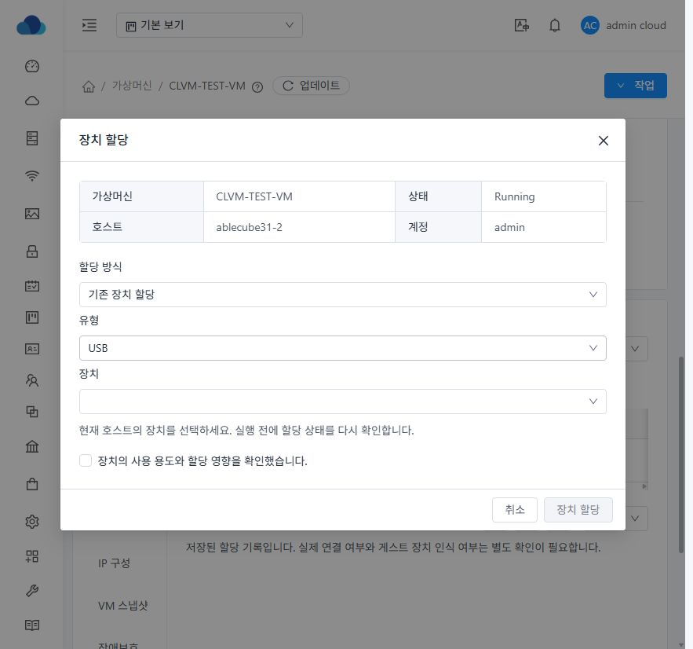

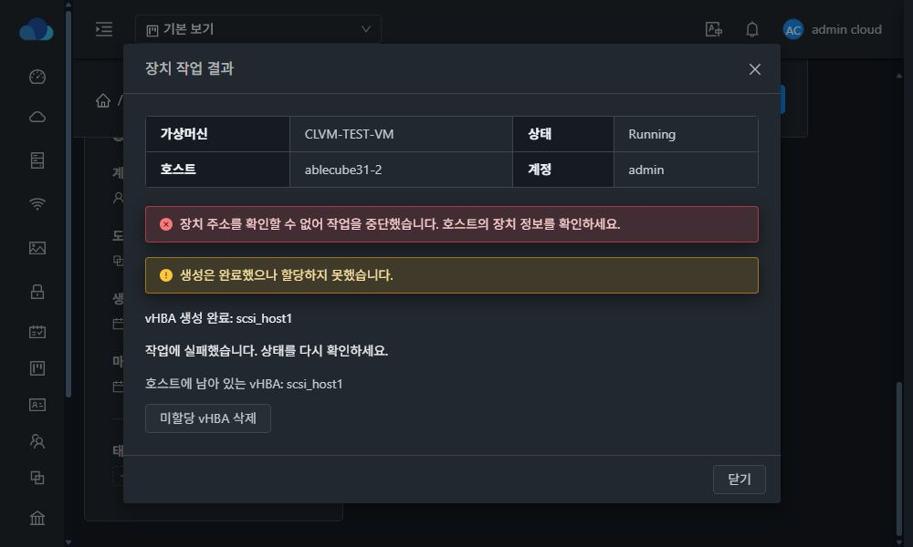
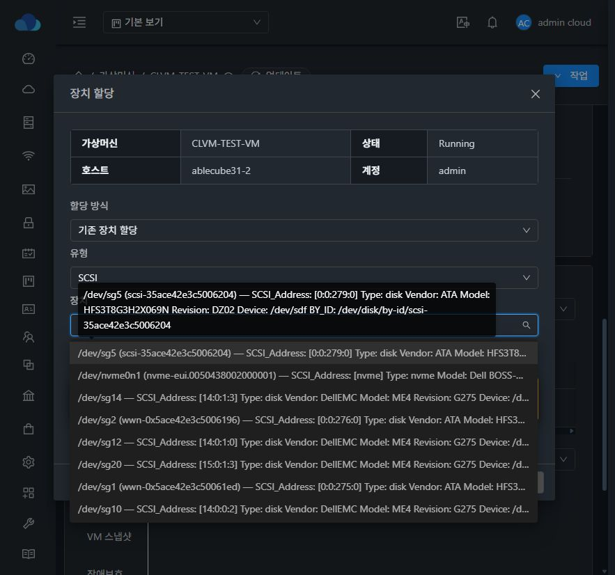
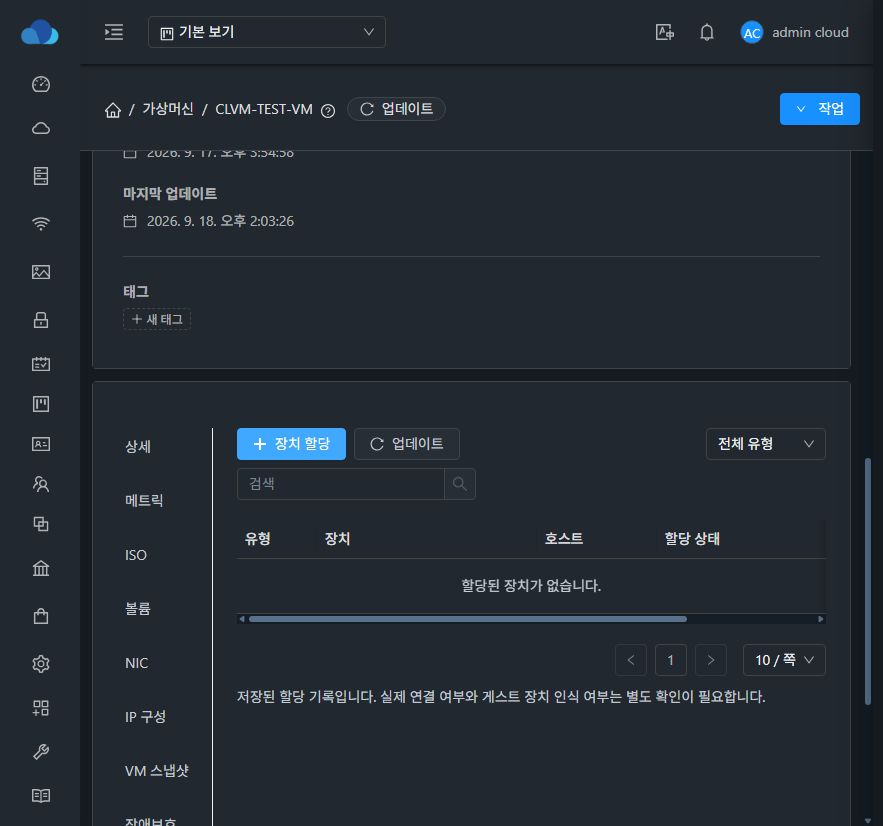

## 배포 및 검증 경계

- 관리 서버는 수정 클래스를 기존 패키지 JAR에 반영하고 백업을 보존했다. 추가 `core` 변경은 31-2에서 검증한 뒤 31-1/31-3에도 반영했고 각 호스트의 기존 VM 목록이 유지됨을 확인했다.
- UI는 기존 PR #1131/#1133의 테스트 배포 내용을 유지하는 통합 검증 브랜치에서 빌드한다. 이 PR의 기능 diff에는 해당 UI 변경을 섞지 않는다.
- 정적 파일만 갱신하고 `WEB-INF`, `config.json`을 보존한다. 배포 후 파일 해시, 서비스 상태 및 `/client/` HTTP 200을 확인한다.
- 모든 장치 종류의 실제 할당이나 재시작 지속성을 검증한 것은 아니다. USB/물리 HBA/FC LUN 후보는 관리 또는 공용 스토리지에 사용 중이므로 제외했다. PCI 실제 할당도 이번 검증 범위에 포함하지 않았다.
- vHBA의 실제 SAN LUN 할당 성공은 별도 zoning/mapping 환경에서 추가 검증이 필요하다. 생성·부분 실패·미할당 삭제 경로와 SCSI 실장치 왕복 테스트를 구분해 보고한다.
- GitHub Actions 라이선스 검사는 통과했다. 저장소 전체 pre-commit 검사에는 기존 문서/라이선스 등 실패가 있으며, 실패 경로 118개가 기준 커밋과 동일한 blob임을 확인했다. 이번 변경의 이미지 확장자와 문서 라이선스 서식 문제는 정리했다. 전체 CI 통과로 보고하지 않는다.

## LUN/SCSI 사용 중 장치 보호 추가 검증 (2026-09-20)

기존 `haspartitions` 응답을 선택 화면에서 사용하지 않았고, 실제 호스트 검사에서도 SCSI 경로의 파티션 여부가 false로 반환되는 사례가 있었다. 기존 교차 유형 중복 검사도 XML 문자열 검색에 의존해 별칭이나 동일 유형 연결을 놓칠 수 있었다.

- 기존 LUN/SCSI 목록 API에 `deviceusagestatus` 맵을 추가한다. 새 API/DB 스키마는 만들지 않는다.
- lsblk의 파티션·파일시스템·마운트·LVM 관계와 WWN을 이용해 원본 경로, multipath, 하위 볼륨을 같은 사용 관계로 검사한다. 비어 있는 multipath 매핑 자체는 사용 중 볼륨으로 간주하지 않는다.
- 현재 호스트의 모든 libvirt VM에 대해 실행 XML과 영구 설정의 block disk/SCSI hostdev를 확인한다. `/dev/sg*`, by-id, block, SCSI 주소 별칭을 실제 블록 장치로 해석한다.
- 사용 중이거나 사용 여부를 확인할 수 없는 후보는 숨기지 않고 선택을 막는다. 한국어/영어 사유와 전체 내용 툴팁을 제공한다. 구버전 에이전트가 검사 상태를 반환하지 않는 경우도 선택할 수 없다.
- 화면을 열 때의 상태를 신뢰하지 않고 제출 전 목록을 다시 조회한다. 에이전트는 LUN/SCSI 및 같은 SCSI XML을 사용하는 HBA/vHBA 연결 직전에 실제 XML source를 다시 검사한다. 해제는 사용 중 검사로 막지 않는다.

### 빌드와 서버 검증

- 변경 api/core/server 모듈 및 UI를 WSL ext4에서 빌드했다. UI 단위 테스트 10개, 장치 안전 검사 7개, 기존 vHBA 직렬화 테스트 1개가 통과했다.
- 안전 검사 테스트는 빈 디스크, 파티션, 파일시스템/LVM/swap/마운트, multipath 별칭, 실행/영구 VM 연결, 검사 실패와 잘못된 XML을 포함한다.
- Apache RAT: 미승인 0, 알 수 없음 0. 검사 오류를 사용 가능으로 처리하지 않는다.
- 31번 관리 서버와 호스트 3대에 변경 클래스를 배포하고 기존 JAR 백업을 보존했다. 모든 호스트가 Up이며 VM 실행 목록이 유지됐다.
- 31-2의 `/dev/sdb`·`/dev/sg1`은 available, 파티션이 있는 `/dev/sdc`는 partitioned, GFS2 `/dev/mapper/mpatha`는 mounted, VM 볼륨이 있는 `/dev/mapper/mpathb`는 vm-connected로 검증됐다.
- 파티션이 있는 로컬 SCSI 후보를 직접 API로 요청하면 `Block device allocation denied: partitioned`로 거부되며 할당 기록은 변경되지 않았다. 사용 중인 FC LUN을 실제로 연결하는 테스트는 하지 않았다.

검사는 해당 호스트의 block/libvirt 상태를 기준으로 한다. 관리 경로 밖에서 다른 SAN 호스트가 사용하는, 서명도 없는 raw LUN의 전역 소유권까지 증명하는 분산 SAN 예약 기능은 아니다.

### 배포 UI와 실장치 왕복 검증

- 다크모드에서 파티션 후보를 클릭해도 선택 값이 비어 있고 할당 버튼이 비활성임을 확인했다. 후보 전체 이름과 제한 사유를 hover 툴팁으로 확인했다.
- multipath LUN 3개가 목록에서 사라지지 않고 모두 비활성 상태임을 DOM과 화면으로 확인했다.
- 빈 `/dev/sg1`을 UI로 연결한 뒤 상태가 `available → vm-connected`로 바뀌고 재선택이 차단됐다. 같은 디스크를 `/dev/sdb` LUN source로 바꾸어 API 요청해도 `vm-connected` 사유로 거부됐다.
- UI 해제 후 다시 `available`로 돌아왔다. libvirt hostdev가 없고 기존 볼륨 XML이 테스트 전과 동일했다. QGA 게스트 디스크 수는 연결 시 9개 → 해제 후 8개로 복원됐다.
- 다크모드 비활성 옵션은 배경 `rgb(31,31,31)`, 글자 `rgba(255,255,255,0.65)`이며 라이트모드는 흰 배경과 `rgb(75,85,99)` 글자를 사용한다. 양쪽 모드의 목록/툴팁 가독성을 실제 화면에서 확인했다.
- 기존 서버 가드 6개를 다시 실행해 통과했다. 이번 재검증의 자동 테스트 합계는 24개다.
- UI 정적 파일 829개의 해시가 일치하고 WEB-INF/config.json/서비스 PID가 보존됐다. HTTP 200 및 모든 호스트 Up을 확인했다.

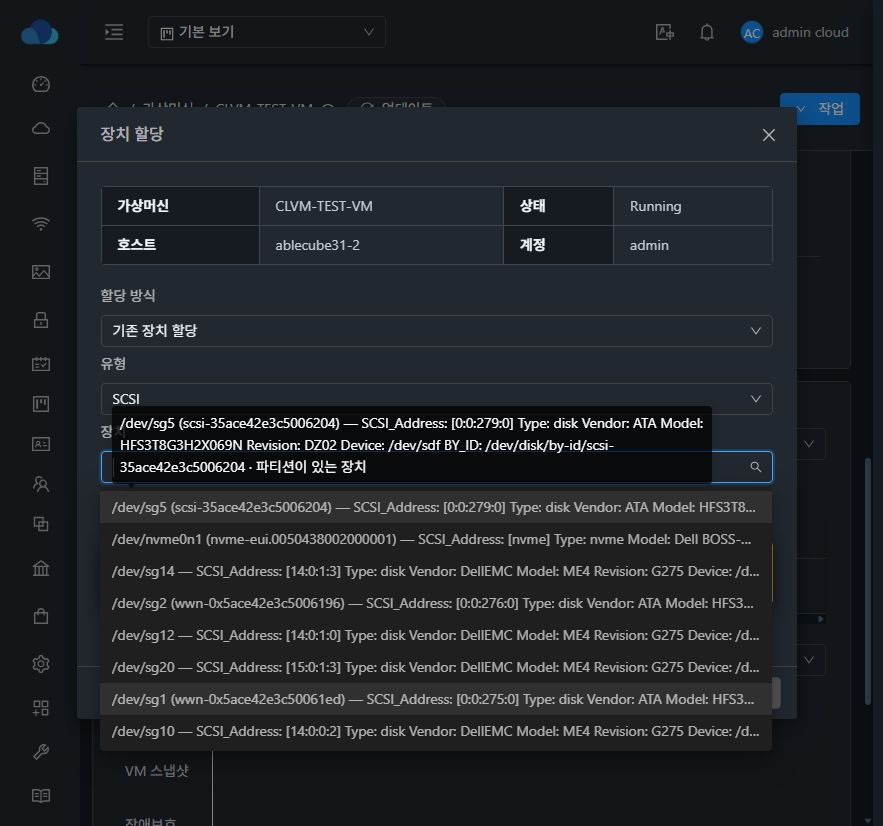
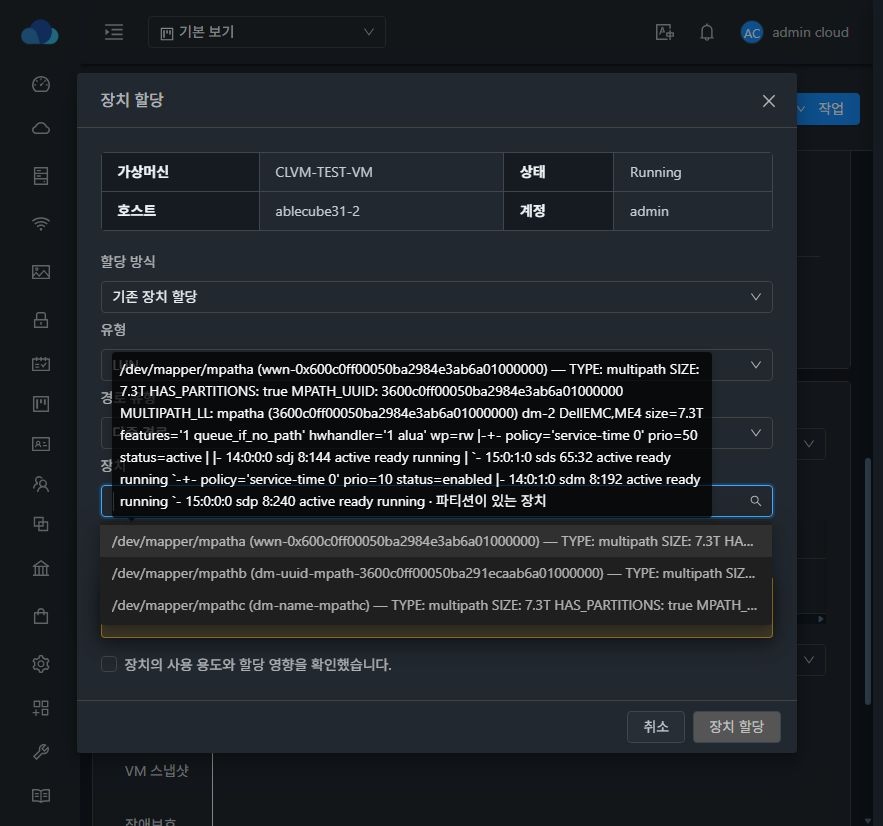
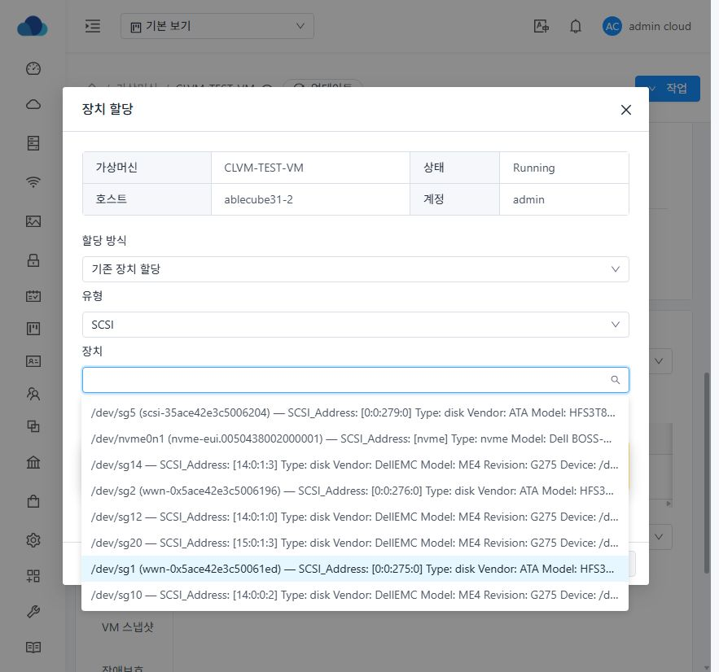

## 일반 디스크 식별 개선 (2026-09-20)

- 유형 선택/필터/행/상세에서 SCSI를 `일반 디스크(SATA/SAS·SCSI)`, LUN을 `외부 LUN(FC/iSCSI)`로 표시한다.
- 일반 디스크 후보는 `lsblk 경로 · 용량 · 모델`을 첫 줄에 표시하고, 기존 sg/WWN 식별자와 제한 사유는 다음 줄에 표시한다. 상세 내용은 툴팁에서 확인한다.
- 기존 API 유형, 제출 식별자, XML source는 변경하지 않는다. USB/PCI/HBA 후보의 기존 설명도 유지한다.
- 기존 SCSI 목록 설명에 SIZE를 추가했다. 31-2의 sdb/sdg/sdh/sdi에서 API의 3576.98G 값과 lsblk 바이트 용량 환산값이 일치했다.
- 변경 Core 모듈 빌드와 Core 테스트 8개, UI ESLint와 UI 테스트 11개가 통과했다. 표시 함수가 연결 식별자/XML을 바꾸지 않는 테스트를 포함한다.
- 호스트 3대의 Core 변경 배포 전후 VM 목록/마운트 목록이 동일하고 모두 Up 상태임을 확인했다.

### 최종 UI 배포 및 검증

- UI 빌드 버전 `v4.10.0-Europa-20260918`. 정적 파일 829개 해시 일치, WEB-INF/config.json 보존, 관리 서비스 PID 유지 및 HTTP 200을 확인했다.
- 실제 다크/라이트 화면에서 경로·용량·모델과 둘째 줄 식별자·차단 사유가 읽히고 겹치지 않음을 확인했다.
- `/dev/sdb` 검색으로 `/dev/sg1` 후보를 찾고 전체 내용 hover 툴팁을 확인했다. UI 연결 후 libvirt source는 기존 `scsi_host0`, `0:275:0`으로 일치했다.
- UI 해제 후 hostdev 없음, 기존 disk XML 일치, QGA guest-ping 정상으로 복구를 확인했다.
- 1000×600 화면에서 대화상자 y=24, 높이=552px로 중앙 정렬됐다. 본문 scrollTop 0→82 이동 시 제목 y=24, 하단 버튼 영역 y=523이 유지됐다.

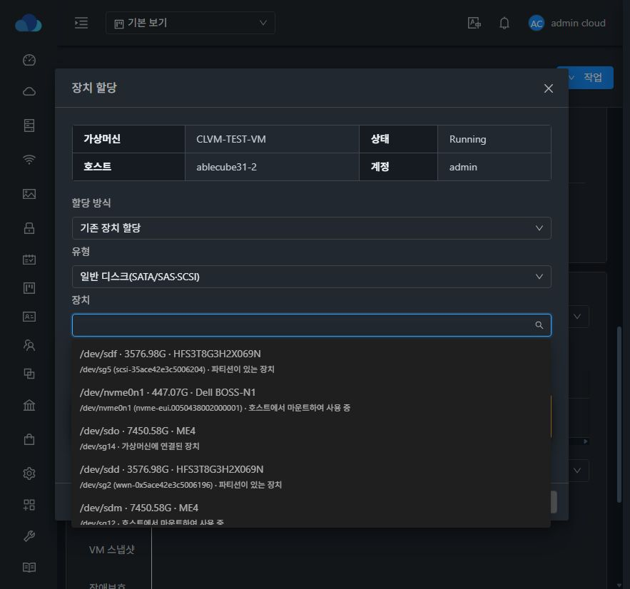
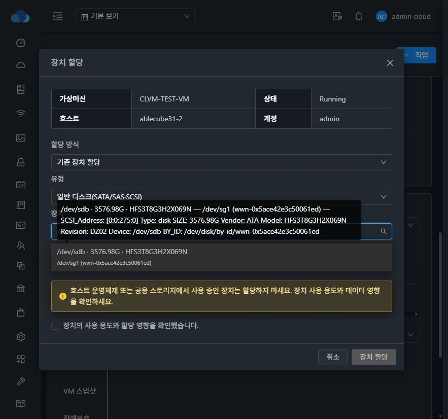
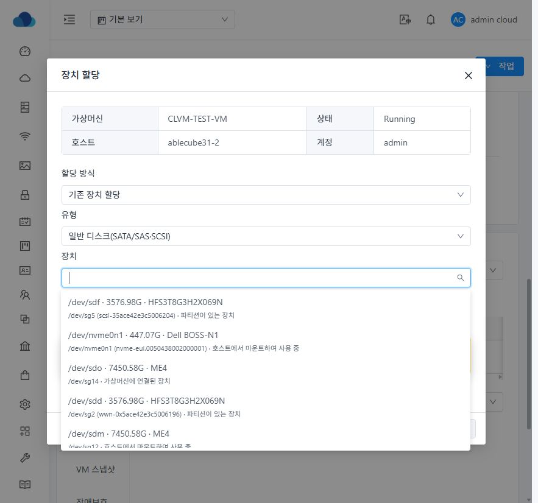
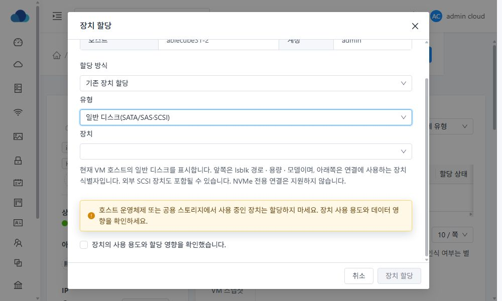

## 호스트 장치 용어 및 배치 검증 (2026-09-20)

- 소스 커밋: `6ef5c6fb303`. 탭은 `호스트 장치`, 주요 버튼/할당 대화상자는 `호스트 장치 할당`으로 표시한다. 표/선택 필드/빈 상태/안내 문구와 영어 번역도 함께 정리했다.
- UI ESLint, 기존 UI 테스트 11개, WSL ext4 UI 모듈 빌드가 통과했다. 소스 커밋의 GitHub License Check 및 로컬 RAT가 통과했다.
- 31번 관리 서버에 정적 UI 파일 829개를 배포하고 전체 파일 해시 일치를 확인했다. WEB-INF/config.json/관리 서비스 PID(273539)가 보존됐으며 서비스 active 및 HTTP 200을 확인했다.
- 실제 브라우저의 다크/라이트 모드에서 탭, 버튼, 표와 할당 대화상자 문구의 가독성과 정렬을 확인했다. 주요 버튼과 업데이트 버튼은 동일 높이 32px, 간격 8px이며 텍스트 잘림이 없다.
- 1000×600 화면에서 대화상자는 y=24, 높이 552px로 중앙에 배치됐다. 본문 scrollTop 0→82 동안 제목 y=24, 하단 버튼 y=523이 유지됐다.
- 이번 추가 변경은 표시/배치에 한정되며 장치 할당 API와 런타임 처리를 바꾸지 않았다. 실제 장치 연결/해제 결과는 앞선 검증 항목을 참조한다.
- 전체 저장소 GitHub Lint는 실패 상태이며 변경 UI 파일 ESLint 및 License Check 통과와 구분한다.

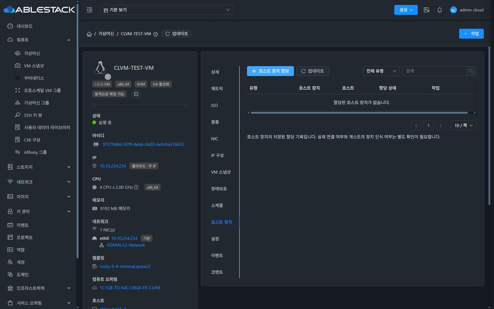
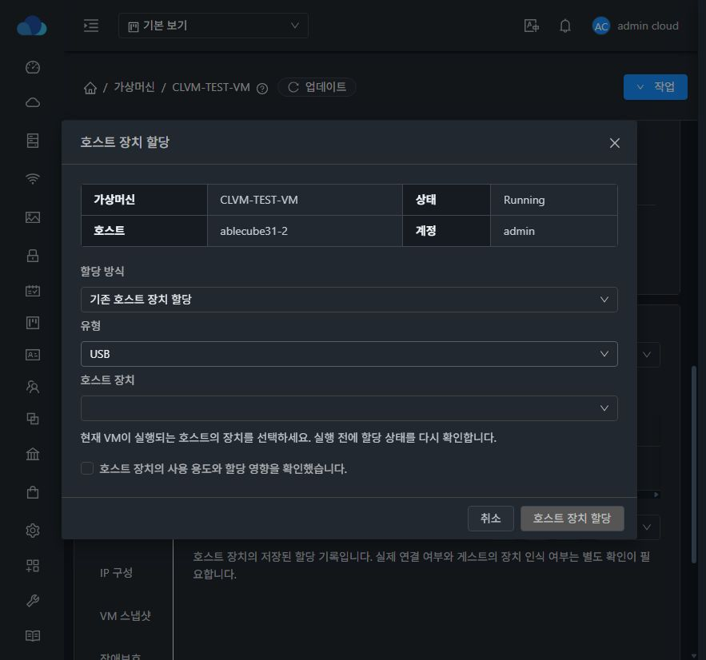
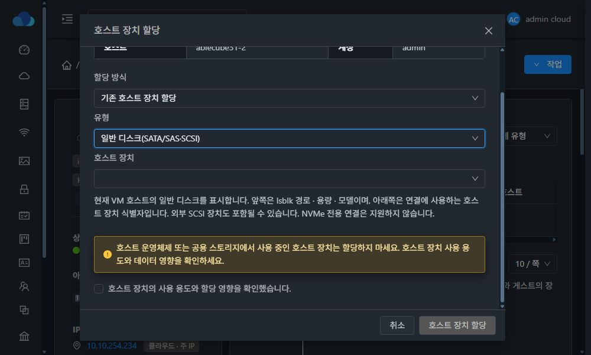
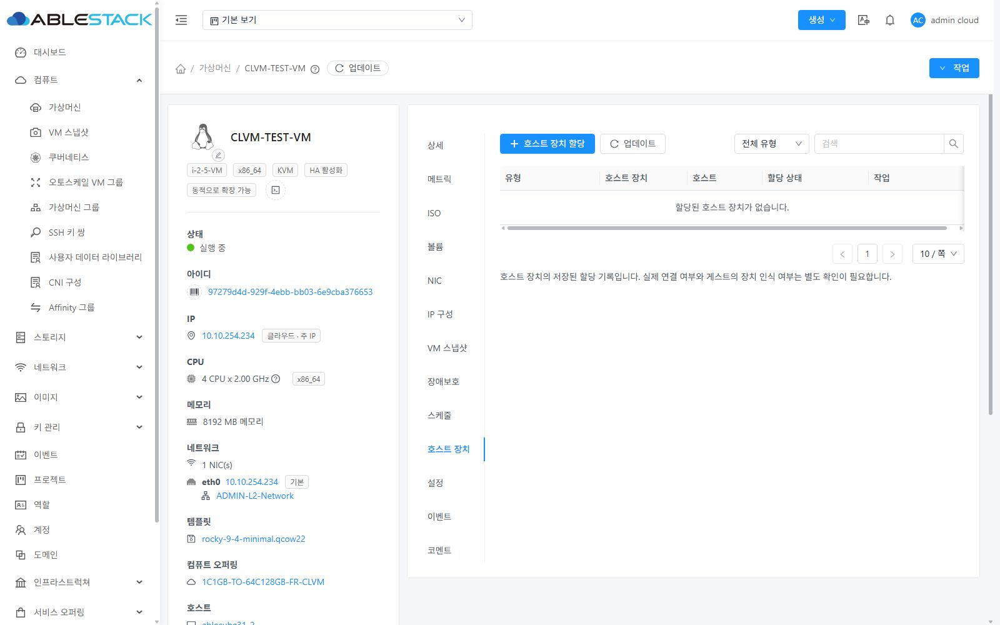
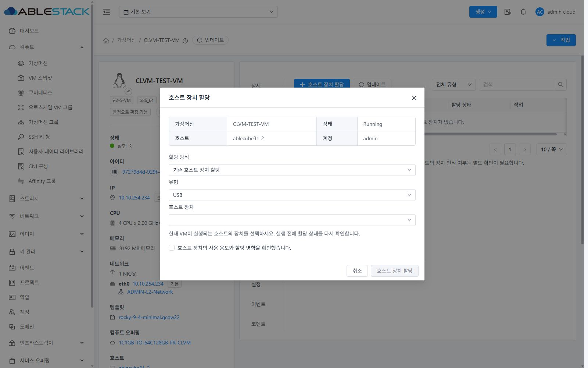
