<!--
Licensed to the Apache Software Foundation (ASF) under one
or more contributor license agreements.  See the NOTICE file
distributed with this work for additional information
regarding copyright ownership.  The ASF licenses this file
to you under the Apache License, Version 2.0 (the
"License"); you may not use this file except in compliance
with the License.  You may obtain a copy of the License at

  http://www.apache.org/licenses/LICENSE-2.0

Unless required by applicable law or agreed to in writing,
software distributed under the License is distributed on an
"AS IS" BASIS, WITHOUT WARRANTIES OR CONDITIONS OF ANY
KIND, either express or implied.  See the License for the
specific language governing permissions and limitations
under the License.
-->

# VM 설정 탭 검증 — 이슈 #1136

## 구현 및 범위

- VmSettingsTab은 VM 전용이다. 공유 DetailSettings의 템플릿/DR 사용처는 변경하지 않는다.
- 설정 추가·업데이트 도구 모음, 이름/값 검색, 10/20/50개 페이징, 편집 대표 버튼, 삭제/상세 드롭다운을 제공한다. 상세는 메뉴 마지막이다.
- 기존 listVirtualMachines/listDetailOptions/listTemplates/updateVirtualMachine API만 사용한다. VM 정지 상태와 권한, 읽기 전용/TPM/템플릿 제약을 적용한다.
- 최신 조회로 다른 변경을 감지하면 재확인을 요구하며, API 실패 시 입력/원본 목록을 보존한다. 서버 원자적 버전 잠금을 추가한 것은 아니다.

## 빌드 및 자동 검증

- WSL ext4 경로의 UI 모듈만 빌드. 표시 버전 v4.10.0-Europa-20260918.
- VmSettings 15개 + 기존 DetailSettings 9개 = 24개 테스트 통과. 변경 UI/유틸/테스트 ESLint 통과.
- 단위 테스트: TPM 보존, 마지막 항목 정리, readonly/deployasis, 비디오 교체, 중복 키, 상태 변경, 충돌, API 실패, VM 전환, ISO 템플릿, 빈 템플릿 응답, 중복 제출, 갱신 실패.
- 기준 브랜치의 기존 12개 RAT 탐지를 해결했다. 기존 소스/문서 헤더 6개와 생성 로그 6개의 명시적 제외를 보완했다.

## 31번 클러스터 실제 UI 검증

- 정지된 전용 VM settings1136-ui-test (0c694546-c64d-44c1-b61f-5c510b9a0167)를 startvm=false로 생성했다. 실행 중 기존 VM은 정지하지 않았다.
- UI에서 ui.validation.1136 설정 추가 → 값 편집 → 값 검색 → 삭제를 수행했다. API 재조회 후 원본 details와 완전히 일치함을 확인했다. CPU/memory/TPM 설정은 보존됐다.
- UI에서 video.hardware=virtio, 장치 수 4개 저장 후 API로 hardware 4개와 ram=16384 4개를 확인했다. 13개 설정에 대해 다음 페이지 이동과 검색 시 첫 페이지 복귀를 검증했다. 이후 API로 원본 details를 복원하고 일치를 확인했다.
- TPM 행의 편집·삭제 비활성, 상세의 차단 사유를 확인했다. 중복 cpuNumber 추가는 차단되고 입력이 유지됐다.
- 실행 중 CLVM-TEST-VM에서 추가·편집·삭제 차단 및 상세 조회 가능을 확인했다.
- 다크/라이트 목록·페이징·안내·오류 문구를 확인했다. 편집 이름 필드의 낮은 대비를 발견하여 readonly 입력과 테마 색상으로 수정했다.
- 1000×600에서 대화상자 y=24, 높이=552px. 본문 scrollTop 0→128일 때 제목 y=24, 하단 버튼 y=523 유지.
- 초기 정적 UI 829개 해시 일치. WEB-INF/config.json/관리 PID 273539 보존, mold active 및 /client/ HTTP 200.

## 증거 이미지

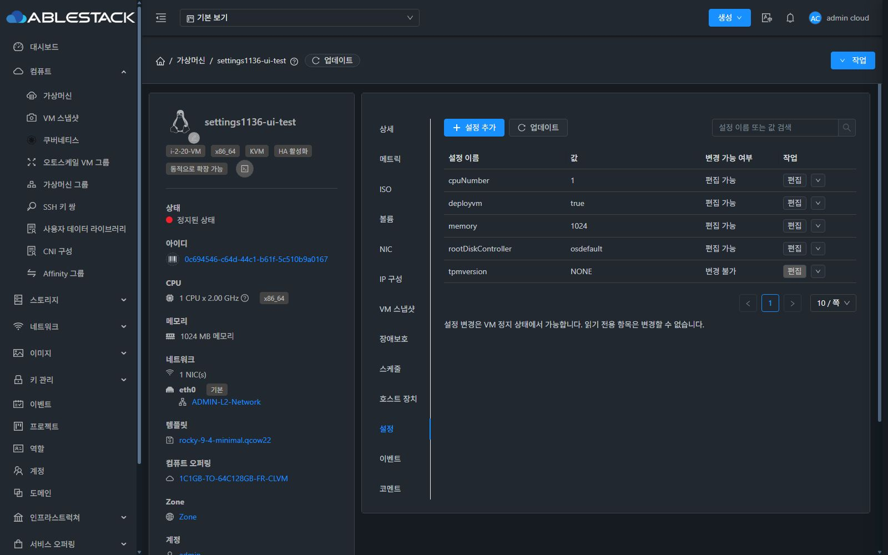
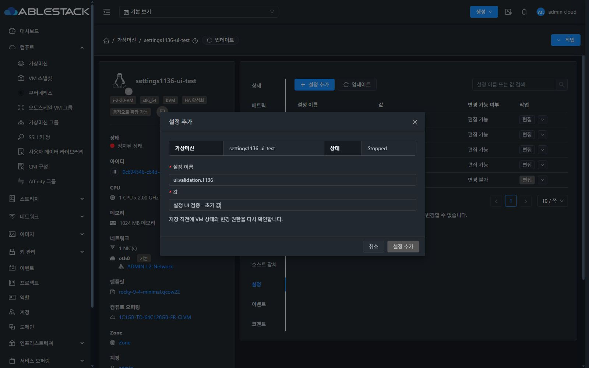
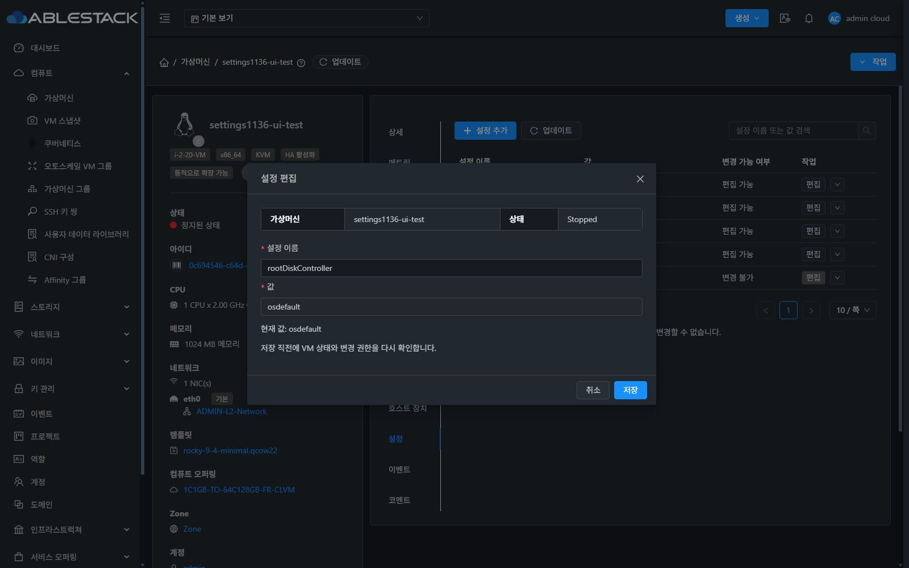
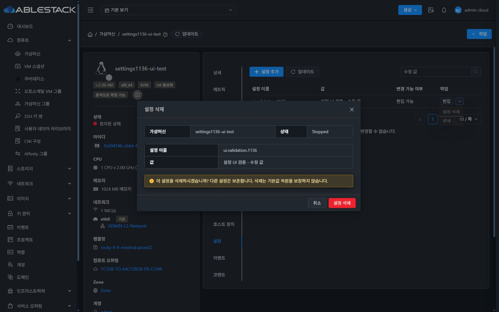
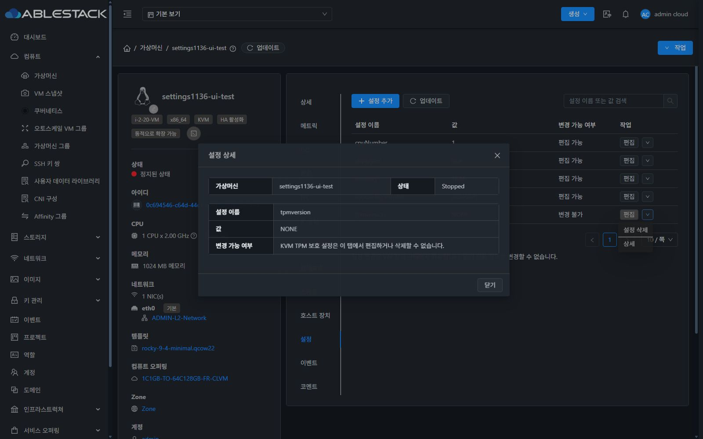
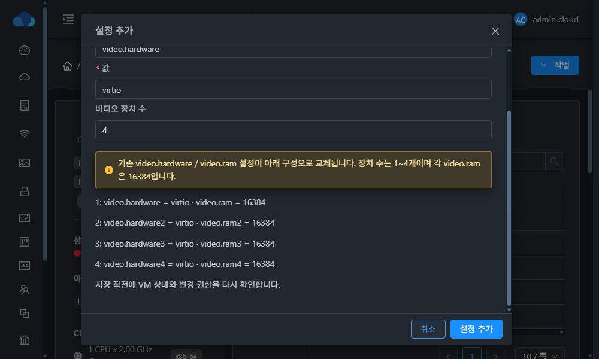
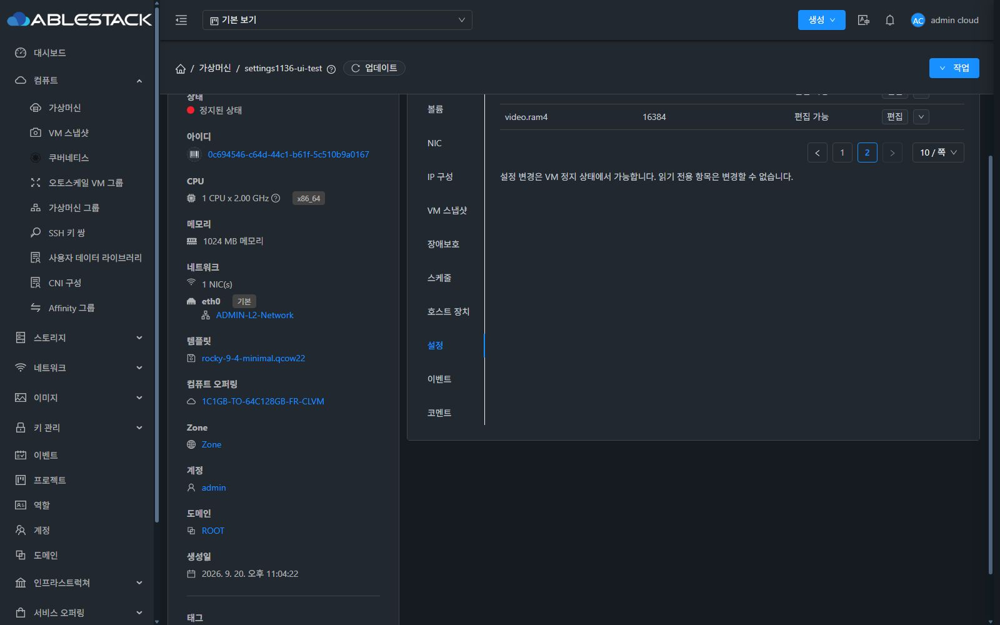
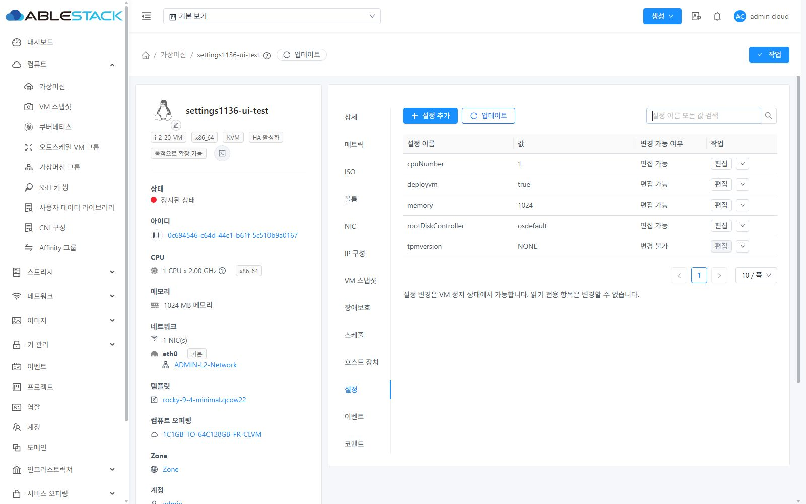
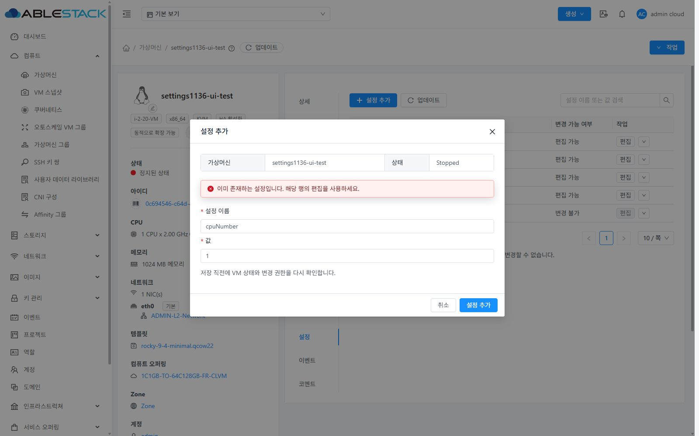
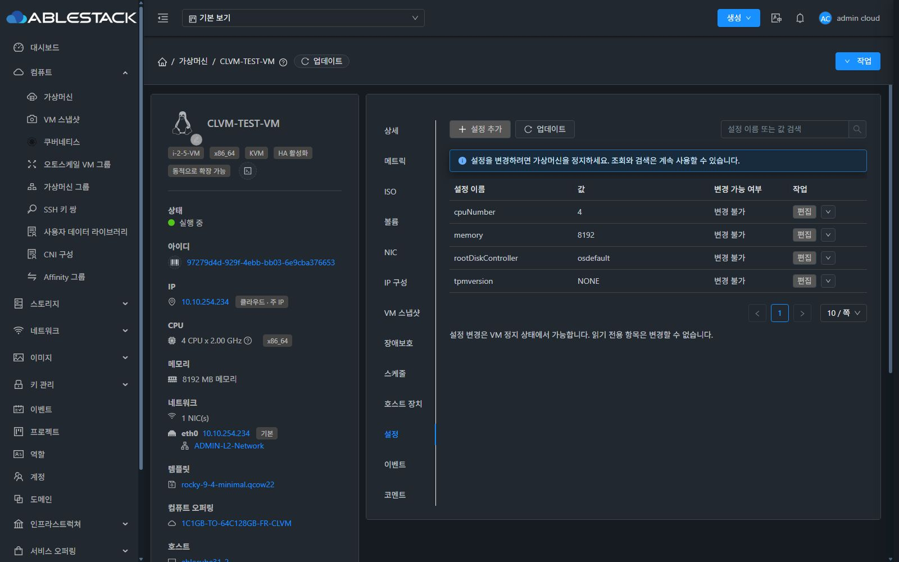

## 최종 배포 및 정리

- 소스 `dbbc4ba3af1`의 UI 변경을 기존 클러스터 UI와 통합하여 재빌드/재배포했다. 최종 829개 파일 해시 일치, WEB-INF/config.json/PID 보존, mold active와 HTTP 200을 확인했다.
- 이름 필드는 readonly로 고정하면서 다크모드 글자 rgb(197,204,212) / 배경 rgb(22,27,34), 라이트모드 글자 rgb(75,85,99) / 배경 rgb(245,247,250)로 표시됨을 DOM과 스크린샷으로 확인했다. 취소 시 원본 설정이 유지됐다.
- 테스트 VM을 원본 설정으로 복원한 뒤 destroyVirtualMachine 비동기 작업 성공을 확인했다. expunge는 요청하지 않았다.
- 이번 실제 UI 테스트 계정은 admin이다. 템플릿 제약·조회/API 실패·충돌·중복 제출은 자동 테스트로 확인했다. 다른 역할의 실제 UI 검증은 수행하지 않았으며 전체 역할별 E2E 또는 전체 Cloud 빌드 성공으로 간주하지 않는다.

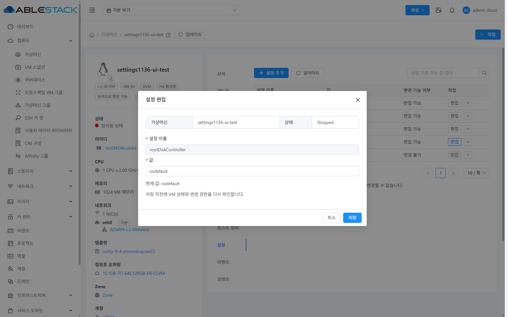
