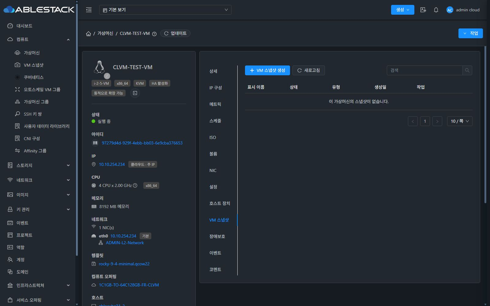
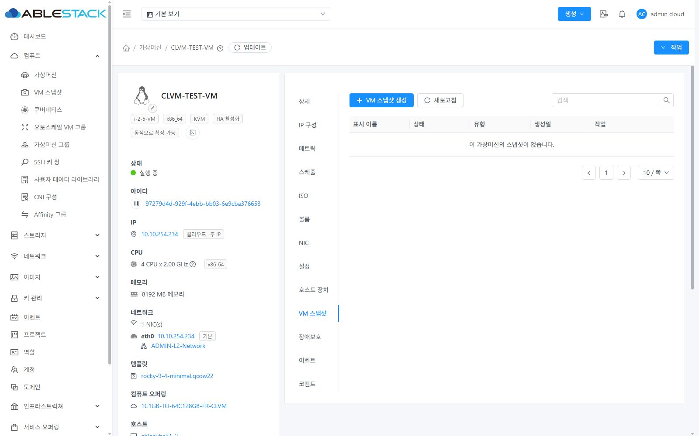

<!--
Licensed to the Apache Software Foundation (ASF) under one
or more contributor license agreements.  See the NOTICE file
distributed with this work for additional information
regarding copyright ownership.  The ASF licenses this file
to you under the Apache License, Version 2.0 (the
"License"); you may not use this file except in compliance
with the License.  You may obtain a copy of the License at

  http://www.apache.org/licenses/LICENSE-2.0

Unless required by applicable law or agreed to in writing,
software distributed under the License is distributed on an
"AS IS" BASIS, WITHOUT WARRANTIES OR CONDITIONS OF ANY
KIND, either express or implied.  See the License for the
specific language governing permissions and limitations
under the License.
-->

# VM 상세 탭 순서 변경 검증

## 순서

상세 → IP 구성 → 메트릭 → 스케줄 → ISO → 볼륨 → NIC → 보안 그룹 → 설정 → 호스트 장치 → GPU → VM 스냅샷 → 백업 → 장애보호 → DR 계획 → 이벤트 → 코멘트

GPU·백업·보안 그룹의 위치는 사용자 지정에 따른다. 기존 번역과 표시 조건을 유지한다.

## 변경 범위

InstanceTab.vue의 17개 탭 선언 블록을 재배치한다. 각 블록의 내용, API 권한·VM 속성에 따른 표시 조건, 탭 키 및 나머지 스크립트/스타일이 이전과 동일한지 비교했다.

기존 upstream 파일의 라이선스 헤더 누락 6개와 생성된 검증 로그 6개의 RAT 제외 설정을 별도 커밋으로 보완했다.

## 빌드와 배포 범위

WSL ext4의 UI 통합 작업 트리에서 빌드한다. 31번 클러스터의 기존 미병합 UI 개선(스케줄, 볼륨, 호스트 장치, 설정)을 포함해 보존하며, 이번 PR의 기능 변경은 탭 순서만 포함한다. 전체 Cloud 빌드는 실행하지 않는다.
## 결과

- UI 모듈 빌드와 변경 파일 ESLint 통과.
- Apache RAT 통과: Unapproved 0, unknown 0.
- 배포 산출물 SHA256: 3212df2ce417ff6c4e393903dd50877c61b94d2d375ce57730dfbe678e2bcafe
- 31번 관리 서버에서 정적 파일 829개 SHA256 일치, WEB-INF 및 config.json 보존, mold active, PID 273539 유지, /client/ HTTP 200.
- 배포 백업: /root/vm-tab-order-ui-backup-20260920
- CLVM-TEST-VM의 실제 표시 탭 13개: 상세 → IP 구성 → 메트릭 → 스케줄 → ISO → 볼륨 → NIC → 설정 → 호스트 장치 → VM 스냅샷 → 장애보호 → 이벤트 → 코멘트.
- IP 구성, 스케줄, 호스트 장치, VM 스냅샷 탭 클릭 후 해당 패널과 URL 전환 확인. VM 스냅샷 선택 후 브라우저 새로고침에도 선택 유지.
- 다크/라이트 모드에서 탭 순서, 간격, 가독성을 실제 브라우저로 확인. 검증 후 다크 테마와 기존 화면 크기 복원.
- GPU·백업·보안 그룹·DR 탭은 대상 VM/환경에서 숨겨져 있어 런타임 표시는 검증하지 않았다. 소스에서 전체 순서 및 조건 보존을 검증했다.
- VM 자원 생성/변경 없이 조회와 화면 이동만 수행했다. 전체 Cloud 빌드는 수행하지 않았다.

